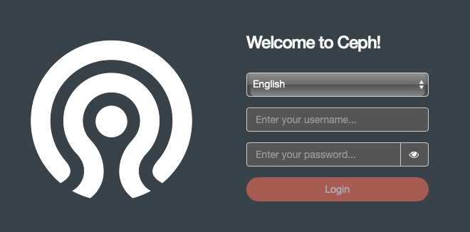

In [part 2]() we installed Kubernetes and setup a user (in my case `adminlocal`) on our cluster with the ability to run administrative kubernetes commands.

etcd (key/value store), Rook, Promethues and Vault are all examples of technologies we will be using in our cluster and are deployed using [Kubernetes Operators](https://kubernetes.io/docs/concepts/extend-kubernetes/operator/). In this section we'll be deploying the [Rook](https://rook.io) storage orchestrator with [Ceph](http://ceph.com) as a storage provider. 

# Components
## Rook
[Rook](https://rook.io) allows us to use storage systems in a cloud-agnostic way and replicate the feel of a public cloud where you attach a storage volume to a container for application data persistence (e.g. EBS on AWS). We're going to configure it to use Ceph as a storage provider.

More information on the architecure can be found in the [docs](https://rook.github.io/docs/rook/master/ceph-storage.html)


## Ceph
Ceph provides three types of storage:

* `object`: compatible with S3 API
* `file`: files and directories (incl. NFS); and
* `block`: replicate a hard drive

There a 4 key components of the architecture to be aware of (shown above in the Rook diagram):

* `Monitor` (min 3): keeps a map of state in cluster for components to communicate with each other and handles authentication
* `Manager` daemon: keeps track of state in cluster and metrics
* `OSDs` (Object Storage daemon, min 3): stores the data. These will run on multiple nodes and handle the read/write operations to their underlying storage.
* `MSDs` (Metatdata Server): concerned with filesystem storage type only

Under the hood everything is stored as an object in logical storage pools.

# Installation and Setup
## Deployment of the Rook operator
See the Rook [quickstart](https://rook.io/docs/rook/v1.1/ceph-quickstart.html)

We're going to download some sample files from the main repo and make a tweak so that we can deploy multiple `mon` components onto a single node. Similar to when we [removed the the control plane node taint](01.infrastructure/02.kubernetes/00.configuring.kubernetes.md#remove-the-control-plane-node-isolation-taint) Ceph will fail to run otherwise (as it wants a quorum of mons across multiple nodes).

```bash
# create a working directory
mkdir -p ~/rook && \
cd ~/rook

# download the sample files
# all of these can be found here: https://github.com/rook/rook/tree/release-1.1/cluster/examples/kubernetes/ceph
wget https://raw.githubusercontent.com/rook/rook/release-1.1/cluster/examples/kubernetes/ceph/common.yaml; \
wget https://raw.githubusercontent.com/rook/rook/release-1.1/cluster/examples/kubernetes/ceph/operator.yaml; \
wget https://raw.githubusercontent.com/rook/rook/release-1.1/cluster/examples/kubernetes/ceph/cluster.yaml; \
wget https://raw.githubusercontent.com/rook/rook/release-1.1/cluster/examples/kubernetes/ceph/toolbox.yaml

# modify the cluster spec
#   - allow multiple mons per node
sed -i.bak 's/allowMultiplePerNode: false/allowMultiplePerNode: true/' cluster.yaml
```

In addition, because we've setup our encrypted data storage to be mounted at `/data/${BLKID}` we will edit the default storage options to remove the `useAllDevices` selection and, instead, specify the directories. See the [docs](https://rook.io/docs/rook/v1.1/ceph-cluster-crd.html#storage-configuration-cluster-wide-directories) for more details.

```bash
# set default storage location and remove default `useAllDevices: true`
sed -i.bak 's/useAllDevices: true/useAllDevices: false/' cluster.yaml
# any devices starting with 'sd' (but not sda as that's our root filesystem)
sed -i.bak 's/deviceFilter:/deviceFilter: ^sd[^a]/' cluster.yaml
# encrypt them with LUKS
# see conversation https://github.com/rook/rook/issues/923#issuecomment-557651052
sed -i.bak 's/# encryptedDevice: "true"/encryptedDevice: "true"/' cluster.yaml
```

With these configurations now downloaded we'll apply them in the following order.

```bash
kubectl create -f ~/rook/common.yaml; \
kubectl create -f ~/rook/operator.yaml
```

???+ warning "Verify the `rook-ceph-operator` is in the `Running` state"
    Use `kubectl -n rook-ceph get pod` to check we have a running state.
    ```bash
    root@banks:~# kubectl -n rook-ceph get pod
    NAME                                            READY   STATUS    RESTARTS   AGE
    ...
    rook-ceph-operator-c8ff6447d-tbh5c              1/1     Running   0          6m18s
    ```

## Create the Rook cluster
Assuming the operator looks ok we can now create the cluster
```bash
kubectl create -f ~/rook/cluster.yaml
```

To verify the state of the cluster we will connect to the [Rook Toolbox](https://rook.io/docs/rook/v1.1/ceph-toolbox.html)

```bash
kubectl create -f ~/rook/toolbox.yaml
```

Wait for the toolbox pod to enter a `running` state:

```bash
kubectl -n rook-ceph get pod -l "app=rook-ceph-tools"
```

Once the rook-ceph-tools pod is running, you can connect to it with:
```bash
kubectl -n rook-ceph exec -it $(kubectl -n rook-ceph get pod -l "app=rook-ceph-tools" -o jsonpath='{.items[0].metadata.name}') bash
```

When inside the toolbox run `ceph status`.

???+ info "ceph status"
    ```bash
    [root@banks /]# ceph status
    cluster:
        id:     06da5ebc-d2f3-4366-a51c-db759d8bc664
        health: HEALTH_OK
    
    services:
        mon: 3 daemons, quorum a,b,c (age 2m)
        mgr: a(active, since 102s)
        osd: 2 osds: 2 up (since 33s), 2 in (since 33s)
    
    data:
        pools:   0 pools, 0 pgs
        objects: 0 objects, 0 B
        usage:   2.0 GiB used, 3.6 TiB / 3.6 TiB avail
        pgs:         
    ```

    * All mons should be in quorum
    * A mgr should be active
    * At least one OSD should be active
    * If the health is not HEALTH_OK, the warnings or errors should be investigated

    ### Troubleshooting: [errno 2]
    **NB:** You might get an error `unable to get monitor info from DNS SRV with service name: ceph-mon` or `[errno 2] error connecting to the cluster` when running `ceph status` in the toolbox if you've typed all of the above commands very quickly. This is usually because the cluster is still starting and waiting for all the monitors to come up and establish connections. Go get a cup of tea / wait a couple of minutes and try again.

    In the `cluster.yaml` spec the default number of `mon` instances is `3`. As a result if you don't have three of these pods running then your cluster is still initialising. You can run `kubectl -n rook-ceph logs -l "app=rook-ceph-operator"` to see an output of the logs from the operator and search for `mons running`. As you can see below it took mine around a minute to initialise all 3. To see what monitors you have run `kubectl -n rook-ceph get pod -l "app=rook-ceph-mon"`.

    ```bash hl_lines="3 5"
    $ kubectl -n rook-ceph get pod -l "app=rook-ceph-mon"
    NAME                               READY   STATUS    RESTARTS   AGE
    rook-ceph-mon-a-5d677b5849-t4xct   1/1     Running   0          82s
    rook-ceph-mon-b-6cfbcf8db4-7cwxp   1/1     Running   0          66s
    rook-ceph-mon-c-8f858c585-c9z5b    1/1     Running   0          50s
    ```

When you are done with the toolbox, you can remove the deployment:
```
kubectl -n rook-ceph delete deployment rook-ceph-tools
```

??? tip "If you want to delete the cluster and start again..."
    Obviously everything worked first time... But, if it didn't, you can always delete everything and start again with the following commands. Essentially undoing what we applied in the yaml configs earlier in reverse. There are some additional pointers [here](https://rook.io/docs/rook/master/ceph-teardown.html) in the docs.
    ```bash
    kubectl delete -f toolbox.yaml; \
    kubectl delete -f cluster.yaml; \
    kubectl delete -f operator.yaml; \
    kubectl delete -f common.yaml; \
    rm -rf ~/rook; \
    sudo rm -rf /var/lib/rook/*
    ```

# Dashboard and Storage
We now have a cluster running but no configured storage or an ability to review status (other than logging into the toolbox).

## Dashboard
Ceph comes with it's own dashboard for management purposes. Let's check the dashboard status. For full details see the [docs](https://rook.io/docs/rook/v1.1/ceph-dashboard.html)

```bash
root@banks:~/rook# kubectl -n rook-ceph get service
NAME                       TYPE        CLUSTER-IP       EXTERNAL-IP   PORT(S)             AGE
csi-cephfsplugin-metrics   ClusterIP   10.107.29.251    <none>        8080/TCP,8081/TCP   14m
csi-rbdplugin-metrics      ClusterIP   10.102.151.196   <none>        8080/TCP,8081/TCP   14m
rook-ceph-mgr              ClusterIP   10.110.58.77     <none>        9283/TCP            12m
rook-ceph-mgr-dashboard    ClusterIP   10.104.71.31     <none>        8443/TCP            12m
rook-ceph-mon-a            ClusterIP   10.101.139.217   <none>        6789/TCP,3300/TCP   13m
rook-ceph-mon-b            ClusterIP   10.109.239.104   <none>        6789/TCP,3300/TCP   13m
rook-ceph-mon-c            ClusterIP   10.99.14.79      <none>        6789/TCP,3300/TCP   13m
```

So it looks like our `rook-ceph-mgr-dashboard` is running on port `8843`. Describing the service indicates it's not yet exposed via a NodePort etc. so we can't access it external to the cluster.

```bash
root@banks:~/rook# kubectl -n rook-ceph describe services rook-ceph-mgr-dashboard
Name:              rook-ceph-mgr-dashboard
Namespace:         rook-ceph
Labels:            app=rook-ceph-mgr
                   rook_cluster=rook-ceph
Annotations:       <none>
Selector:          app=rook-ceph-mgr,rook_cluster=rook-ceph
Type:              ClusterIP
IP:                10.104.71.31
Port:              https-dashboard  8443/TCP
TargetPort:        8443/TCP
Endpoints:         10.244.0.80:8443
Session Affinity:  None
Events:            <none>
```

We'll enable this via a NodePort now.

```bash
cd ~/rook
wget https://raw.githubusercontent.com/rook/rook/release-1.1/cluster/examples/kubernetes/ceph/dashboard-external-https.yaml
kubectl create -f ~/rook/dashboard-external-https.yaml
```

You will see the new service `rook-ceph-mgr-dashboard-external-https` created:

```bash
$ kubectl -n rook-ceph get service
NAME                                     TYPE        CLUSTER-IP       EXTERNAL-IP   PORT(S)             AGE
csi-cephfsplugin-metrics                 ClusterIP   10.102.185.98    <none>        8080/TCP,8081/TCP   18h
csi-rbdplugin-metrics                    ClusterIP   10.108.114.119   <none>        8080/TCP,8081/TCP   18h
rook-ceph-mgr                            ClusterIP   10.107.152.33    <none>        9283/TCP            18h
rook-ceph-mgr-dashboard                  ClusterIP   10.105.220.219   <none>        8443/TCP            18h
rook-ceph-mgr-dashboard-external-https   NodePort    10.98.207.115    <none>        8443:30995/TCP      9s
rook-ceph-mon-a                          ClusterIP   10.101.90.100    <none>        6789/TCP,3300/TCP   18h
rook-ceph-mon-b                          ClusterIP   10.107.14.178    <none>        6789/TCP,3300/TCP   18h
rook-ceph-mon-c                          ClusterIP   10.101.91.134    <none>        6789/TCP,3300/TCP   18h
```

In this example, port `30995` will be opened to expose port `8443` from the `ceph-mgr pod`. Find the ip address of the node or, if you've used Avahi as per the physcial node installation you could probably access the node directly using the hostname (Kubernetes will listen on that fqdn).

??? tip "Finding the IP address"
    So this isn't that obvious... We've exposed our service via a `NodePort` but now need to find the IP address of the actual node in order to hit the required port to see the service...

    ```bash
    $ kubectl -n rook-ceph get pods --selector="app=rook-ceph-mgr" --output=wide
    NAME                              READY   STATUS    RESTARTS   AGE   IP             NODE    NOMINATED NODE   READINESS GATES
    rook-ceph-mgr-a-59cc7fb98-7wfxf   1/1     Running   0          19h   10.244.0.112   banks   <none>           <none>
    ```

    Our service is running on the `banks` node. Let's find the IP of that then.

    ```bash
    $ kubectl describe node banks | grep InternalIP
        InternalIP:  192.168.0.95
    ```

    Or you could find the IP address with:

    ```bash
    kubectl get node banks -o jsonpath='{.status.addresses[0].address}'
    ```

Now you can enter the URL in your browser as https://192.168.0.95:30995 or https://banks.local:30995 and the dashboard will appear.



### Credentials
As described in the [docs](https://rook.io/docs/rook/v1.1/ceph-dashboard.html) Rook creates a default user named admin and generates a secret called rook-ceph-dashboard-admin-password in the namespace where rook is running. To retrieve the generated password, you can run the following:

```bash
kubectl -n rook-ceph get secret rook-ceph-dashboard-password -o jsonpath="{['data']['password']}" | base64 --decode && echo
```


This is a good thing to see...

## Add Storage
We now have Ceph running and managed via Rook on our Kubernetes cluster but don't yet have any storage configured. There are some good [documented examples](https://rook.io/docs/rook/v1.1/ceph-examples.html) we can walk through to get started.

### Block
As per the [docs](https://rook.io/docs/rook/v1.1/ceph-block.html):

>Block storage allows a single pod to mount storage

We need to create both a `StorageClass` and a `CephBlockPool` in order to use black storage on our cluster.

```bash
mkdir -p ~/rook/storage
cd ~/rook/storage

wget https://raw.githubusercontent.com/rook/rook/release-1.1/cluster/examples/kubernetes/ceph/csi/rbd/storageclass.yaml

# - replicas: 1  # we dont want to replicate this
# - failureDomain: osd  # we don't want it to require multiple nodes
sed -i.bak 's/size: 3/size: 1/g' storageclass.yaml; \
sed -i.bak 's/failureDomain: host/failureDomain: osd/g' storageclass.yaml; \
kubectl create -f ~/rook/storage/storageclass.yaml
```

Test this new storage out with a Wordpress installation (including MySQL) which requires the usage of `Volume` and `PersistentVolumeClaim`.

```bash
mkdir -p ~/rook/examples
cd ~/rook/examples

wget https://raw.githubusercontent.com/rook/rook/release-1.1/cluster/examples/kubernetes/wordpress.yaml; \
wget https://raw.githubusercontent.com/rook/rook/release-1.1/cluster/examples/kubernetes/mysql.yaml

kubectl create -f ~/rook/examples/mysql.yaml; \
kubectl create -f ~/rook/examples/wordpress.yaml
```

To review the volumes that have been created run `kubectl get pvc`
```bash
$ kubectl get pvc
NAME             STATUS   VOLUME                                     CAPACITY   ACCESS MODES   STORAGECLASS      AGE
mysql-pv-claim   Bound    pvc-29aa4aba-4029-487d-8e7e-b2eb08400382   20Gi       RWO            rook-ceph-block   74s
wp-pv-claim      Bound    pvc-7251e045-a174-49e1-9393-fbd8dbcfeaa6   20Gi       RWO            rook-ceph-block   73s
```

Those PVCs can also be seen in the ceph dashboard under `Block` >> `Images`


Once the pods for Wordpress and MySQL are running get the cluster IP for the wordpress app and navigate to it. You should be presented with the installation wizard.


We'll tear this down now before proceeding (but leave the storage class for later usage).

```bash
$ kubectl delete -f wordpress.yaml
service "wordpress" deleted
persistentvolumeclaim "wp-pv-claim" deleted
deployment.apps "wordpress" deleted

$ kubectl delete -f mysql.yaml
service "wordpress-mysql" deleted
persistentvolumeclaim "mysql-pv-claim" deleted
deployment.apps "wordpress-mysql" deleted

# kubectl delete -n rook-ceph cephblockpools.ceph.rook.io replicapool
# kubectl delete storageclass rook-ceph-block
```

### Object
As per the [docs](https://rook.io/docs/rook/v1.1/ceph-object.html)

>Object storage exposes an S3 API to the storage cluster for applications to put and get data.

We'll first create a `CephObjectStore` followed by a `StorageClass` for the bucket.