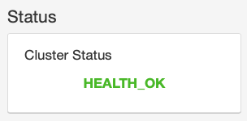

Ceph comes with it's own dashboard for management purposes. Let's check the dashboard status. For full details see the [docs](https://rook.io/docs/rook/v1.1/ceph-dashboard.html)

```bash
root@banks:~/rook# kubectl -n rook-ceph get service
NAME                       TYPE        CLUSTER-IP       EXTERNAL-IP   PORT(S)             AGE
csi-cephfsplugin-metrics   ClusterIP   10.107.29.251    <none>        8080/TCP,8081/TCP   14m
csi-rbdplugin-metrics      ClusterIP   10.102.151.196   <none>        8080/TCP,8081/TCP   14m
rook-ceph-mgr              ClusterIP   10.110.58.77     <none>        9283/TCP            12m
rook-ceph-mgr-dashboard    ClusterIP   10.104.71.31     <none>        8443/TCP            12m
rook-ceph-mon-a            ClusterIP   10.101.139.217   <none>        6789/TCP,3300/TCP   13m
rook-ceph-mon-b            ClusterIP   10.109.239.104   <none>        6789/TCP,3300/TCP   13m
rook-ceph-mon-c            ClusterIP   10.99.14.79      <none>        6789/TCP,3300/TCP   13m
```

So it looks like our `rook-ceph-mgr-dashboard` is running on port `8843`. Describing the service indicates it's not yet exposed via a NodePort etc. so we can't access it external to the cluster.

```bash
root@banks:~/rook# kubectl -n rook-ceph describe services rook-ceph-mgr-dashboard
Name:              rook-ceph-mgr-dashboard
Namespace:         rook-ceph
Labels:            app=rook-ceph-mgr
                   rook_cluster=rook-ceph
Annotations:       <none>
Selector:          app=rook-ceph-mgr,rook_cluster=rook-ceph
Type:              ClusterIP
IP:                10.104.71.31
Port:              https-dashboard  8443/TCP
TargetPort:        8443/TCP
Endpoints:         10.244.0.80:8443
Session Affinity:  None
Events:            <none>
```

We'll enable this via a NodePort now.

```bash
cd ~/rook
wget https://raw.githubusercontent.com/rook/rook/release-1.1/cluster/examples/kubernetes/ceph/dashboard-external-https.yaml
kubectl create -f ~/rook/dashboard-external-https.yaml
```

You will see the new service `rook-ceph-mgr-dashboard-external-https` created:

```bash
$ kubectl -n rook-ceph get service
NAME                                     TYPE        CLUSTER-IP       EXTERNAL-IP   PORT(S)             AGE
csi-cephfsplugin-metrics                 ClusterIP   10.102.185.98    <none>        8080/TCP,8081/TCP   18h
csi-rbdplugin-metrics                    ClusterIP   10.108.114.119   <none>        8080/TCP,8081/TCP   18h
rook-ceph-mgr                            ClusterIP   10.107.152.33    <none>        9283/TCP            18h
rook-ceph-mgr-dashboard                  ClusterIP   10.105.220.219   <none>        8443/TCP            18h
rook-ceph-mgr-dashboard-external-https   NodePort    10.98.207.115    <none>        8443:30995/TCP      9s
rook-ceph-mon-a                          ClusterIP   10.101.90.100    <none>        6789/TCP,3300/TCP   18h
rook-ceph-mon-b                          ClusterIP   10.107.14.178    <none>        6789/TCP,3300/TCP   18h
rook-ceph-mon-c                          ClusterIP   10.101.91.134    <none>        6789/TCP,3300/TCP   18h
```

In this example, port `30995` will be opened to expose port `8443` from the `ceph-mgr pod`. Find the ip address of the node or, if you've used Avahi as per the physcial node installation you could probably access the node directly using the hostname (Kubernetes will listen on that fqdn).

??? tip "Finding the IP address"
    So this isn't that obvious... We've exposed our service via a `NodePort` but now need to find the IP address of the actual node in order to hit the required port to see the service...

    ```bash
    $ kubectl -n rook-ceph get pods --selector="app=rook-ceph-mgr" --output=wide
    NAME                              READY   STATUS    RESTARTS   AGE   IP             NODE    NOMINATED NODE   READINESS GATES
    rook-ceph-mgr-a-59cc7fb98-7wfxf   1/1     Running   0          19h   10.244.0.112   banks   <none>           <none>
    ```

    Our service is running on the `banks` node. Let's find the IP of that then.

    ```bash
    $ kubectl describe node banks | grep InternalIP
        InternalIP:  192.168.0.95
    ```

    Or you could find the IP address with:

    ```bash
    kubectl get node banks -o jsonpath='{.status.addresses[0].address}'
    ```

Now you can enter the URL in your browser as https://192.168.0.95:30995 or https://banks.local:30995 and the dashboard will appear.


# Credentials
As described in the [docs](https://rook.io/docs/rook/v1.1/ceph-dashboard.html) Rook creates a default user named admin and generates a secret called rook-ceph-dashboard-admin-password in the namespace where rook is running. To retrieve the generated password, you can run the following:

```bash
kubectl -n rook-ceph get secret rook-ceph-dashboard-password -o jsonpath="{['data']['password']}" | base64 --decode && echo
```



This is a good thing to see...