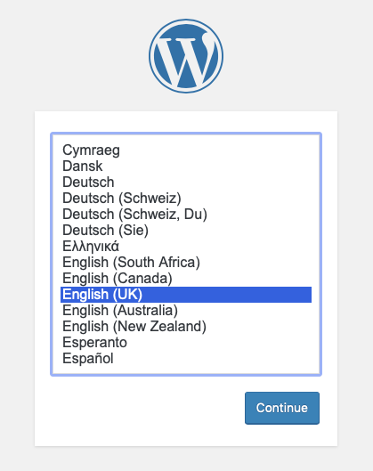

As per the [docs](https://rook.io/docs/rook/v1.1/ceph-block.html):

>Block storage allows a single pod to mount storage

We need to create both a `StorageClass` and a `CephBlockPool` in order to use black storage on our cluster.

```bash
mkdir -p ~/rook/storage
cd ~/rook/storage

wget -O "storageclass-rbd.yaml" https://raw.githubusercontent.com/rook/rook/release-1.1/cluster/examples/kubernetes/ceph/csi/rbd/storageclass.yaml

# - replicas: 1  # we dont want to replicate this
# - failureDomain: osd  # we don't want it to require multiple nodes
sed -i.bak 's/size: 3/size: 1/g' storageclass-rbd.yaml; \
sed -i.bak 's/failureDomain: host/failureDomain: osd/g' storageclass-rbd.yaml; \
kubectl create -f ~/rook/storage/storageclass-rbd.yaml
```

Test this new storage out with a Wordpress installation (including MySQL) which requires the usage of `Volume` and `PersistentVolumeClaim`.

```bash
mkdir -p ~/rook/examples
cd ~/rook/examples

wget https://raw.githubusercontent.com/rook/rook/release-1.1/cluster/examples/kubernetes/wordpress.yaml; \
wget https://raw.githubusercontent.com/rook/rook/release-1.1/cluster/examples/kubernetes/mysql.yaml

kubectl create -f ~/rook/examples/mysql.yaml; \
kubectl create -f ~/rook/examples/wordpress.yaml
```

To review the volumes that have been created run `kubectl get pvc`
```bash
$ kubectl get pvc
NAME             STATUS   VOLUME                                     CAPACITY   ACCESS MODES   STORAGECLASS      AGE
mysql-pv-claim   Bound    pvc-29aa4aba-4029-487d-8e7e-b2eb08400382   20Gi       RWO            rook-ceph-block   74s
wp-pv-claim      Bound    pvc-7251e045-a174-49e1-9393-fbd8dbcfeaa6   20Gi       RWO            rook-ceph-block   73s
```

Those PVCs can also be seen in the ceph dashboard under `Block` >> `Images`


Once the pods for Wordpress and MySQL are running get the cluster IP for the wordpress app and navigate to it. You should be presented with the installation wizard.



We'll tear this down now before proceeding (but leave the storage class for later usage).

```bash
$ kubectl delete -f wordpress.yaml
service "wordpress" deleted
persistentvolumeclaim "wp-pv-claim" deleted
deployment.apps "wordpress" deleted

$ kubectl delete -f mysql.yaml
service "wordpress-mysql" deleted
persistentvolumeclaim "mysql-pv-claim" deleted
deployment.apps "wordpress-mysql" deleted

# kubectl delete -n rook-ceph cephblockpools.ceph.rook.io replicapool
# kubectl delete storageclass rook-ceph-block
```