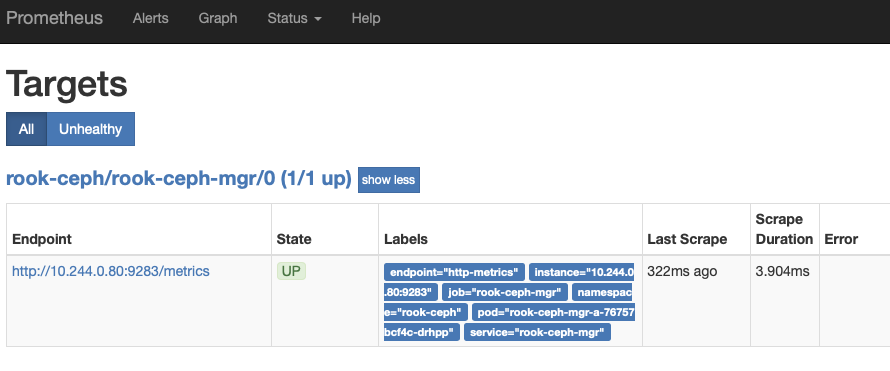
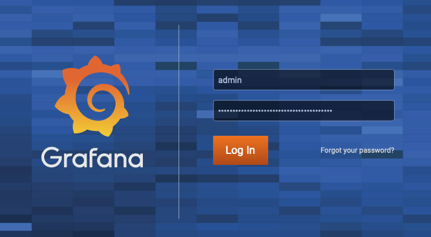
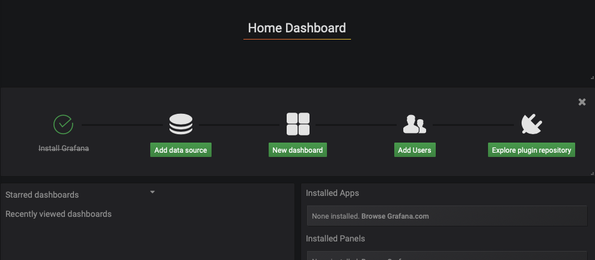
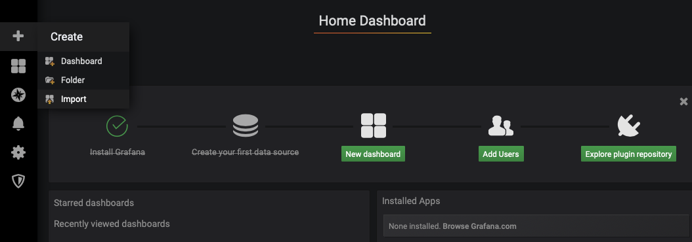
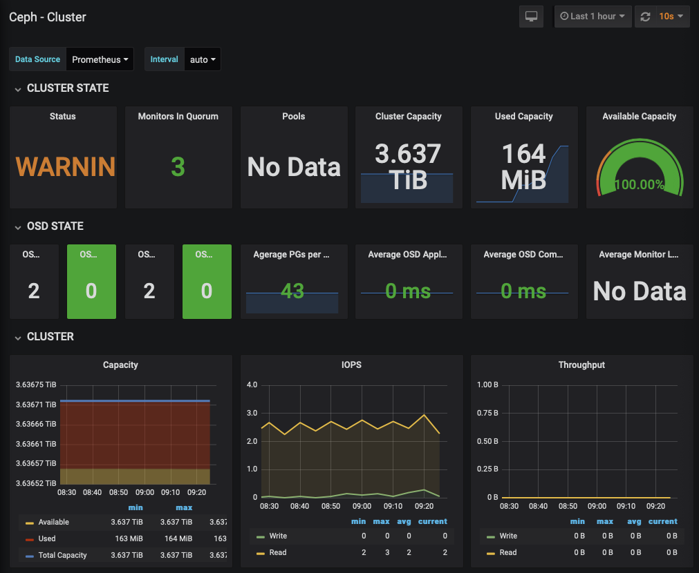

As we've got Ceph (via Rook) installed we'll initially setup Prometheus to monitor metrics and then display them in

# Deploy and configure Prometheus
```bash
mkdir -p ~/monitoring
cd monitoring/

export OPERATOR_VERSION=v0.34.0

wget https://raw.githubusercontent.com/coreos/prometheus-operator/${OPERATOR_VERSION}/bundle.yaml
kubectl apply -f ~/monitoring/bundle.yaml
```

Then wait for the `prometheus-operator` pod to be Running with `kubectl get pods -w`.

Then we need to configure the Ceph specific configuration: monitoring endpoints, alarm levels etc...
```bash
kubectl apply -f https://raw.githubusercontent.com/packet-labs/Rook-on-Bare-Metal-Workshop/master/configs/ceph-monitoring.yml
```

At this point we should be able to reach the Prometheus UI at:
```bash
IP=$(kubectl get nodes -o jsonpath='{.items[0].status.addresses[].address}')
PORT=$(kubectl -n rook-ceph get svc rook-prometheus -o jsonpath='{.spec.ports[].nodePort}')
echo "Your Prometheus UI is available at: http://$IP:$PORT/"
```

Head over to `Status` >> `Target` and make sure that the `ceph-mgr` target is `UP`.



Then go to Graph and graph following query `ceph_cluster_total_used_bytes/(1024^3)` to show the total space used in gigabyte over time. Another query of `(ceph_cluster_total_used_bytes / ceph_cluster_total_used_raw_bytes) * 100` will show the % of available space used.

# Deploy and configure Grafana
```bash
# Install helm
export HELM_VERSION=v3.0.0
wget https://get.helm.sh/helm-${HELM_VERSION}-linux-amd64.tar.gz
tar -xvzf helm-${HELM_VERSION}-linux-amd64.tar.gz
chmod +x linux-amd64/helm
sudo mv linux-amd64/helm /usr/local/bin/
rm -rf {helm*,linux-amd64}

# Add repository
helm repo add stable https://kubernetes-charts.storage.googleapis.com/
helm repo update

# Install grafana
helm install grafana stable/grafana --set service.type=NodePort --set persistence.enabled=true --set persistence.type=pvc --set persistence.size=10Gi --set persistence.storageClassName=rook-ceph-block
```

As can be seen we're using persistence with a `pvc` and telling it to use our `rook-ceph-block` storage. You'll get a lot of data coming out but, ideally, something that look like the below.

```bash
export NODE_PORT=$(kubectl get --namespace default -o jsonpath="{.spec.ports[0].nodePort}" services grafana)
export NODE_IP=$(kubectl get nodes --namespace default -o jsonpath="{.items[0].status.addresses[0].address}")
echo http://$NODE_IP:$NODE_PORT
```



Once logged in you'll see a screen similar to below. Hit the `Add data source` and select `Prometheus`. The url needs to be the details we identified above. We'll need the `Cluster-IP` and `Port` of the service (choose the container port, not the externally exposed one).



```bash
$ kubectl -n rook-ceph get svc rook-prometheus
NAME              TYPE       CLUSTER-IP      EXTERNAL-IP   PORT(S)          AGE
rook-prometheus   NodePort   10.110.175.22   <none>        9090:30900/TCP   16h
```

Hit `Save & Test` and you should hopefully see a `Data source is working` check appear. Hit `Back` to go back to the main screen.


Back on the main screen click on the `+` and select `Import`. Ceph has published some open dashboards with the IDs `2842`, `5336` and `5342`.



NB: On two of the dashboards you need to select `Prometheus` as the datasource.

