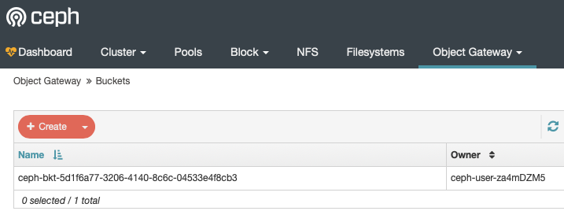
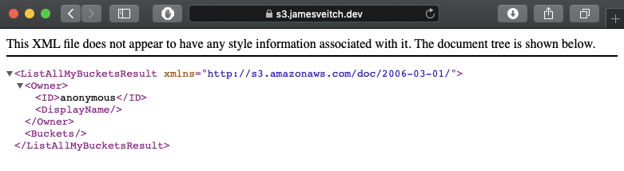

As per the [docs](https://rook.io/docs/rook/v1.1/ceph-object.html)

>Object storage exposes an S3 API to the storage cluster for applications to put and get data.

We'll first create a `CephObjectStore` followed by a `StorageClass` for the bucket.

```bash
cd ~/rook/storage
wget https://raw.githubusercontent.com/rook/rook/release-1.1/cluster/examples/kubernetes/ceph/object-ec.yaml

# - replicas: 1  # we dont want to replicate this
# - failureDomain: osd  # we don't want it to require multiple nodes
sed -i.bak 's/size: 3/size: 1/g' object-ec.yaml; \
sed -i.bak 's/failureDomain: host/failureDomain: osd/g' object-ec.yaml; \
kubectl create -f ~/rook/storage/object/object-ec.yaml
```

Check that the object store is configured and a rgw pod has started.
```bash
$ kubectl -n rook-ceph get pod -l app=rook-ceph-rgw
NAME                                        READY   STATUS    RESTARTS   AGE
rook-ceph-rgw-my-store-a-86d4f98658-tfrj9   1/1     Running   0          27s
```

# Enable dashboard for the Object Gateway
As per the [docs](https://docs.ceph.com/docs/nautilus/mgr/dashboard/#enabling-the-object-gateway-management-frontend) we need to specifically enable access to the object gateway for it to be registered in the Ceph dashboard.

```bash
# Connect to the toolbox first
kubectl -n rook-ceph exec -it $(kubectl -n rook-ceph get pod -l "app=rook-ceph-tools" -o jsonpath='{.items[0].metadata.name}') bash

# Create a system user
radosgw-admin user create \
    --uid=666 \
    --display-name=dashboard \
    --system
```

??? info "Make note of the keys"
    ```bash hl_lines="15 16"
    # radosgw-admin user create \
        --uid=666 \
        --display-name=dashboard \
        --system
    {
        "user_id": "666",
        "display_name": "dashboard",
        "email": "",
        "suspended": 0,
        "max_buckets": 1000,
        "subusers": [],
        "keys": [
            {
                "user": "666",
                "access_key": "MUNSZSY7LF2E202MW1H6",
                "secret_key": "OF1za2LvibBpYjb6mw0umYDePfBkzfWSRNMeIwL0"
            }
        ],
        "swift_keys": [],
        "caps": [],
        "op_mask": "read, write, delete",
        "system": "true",
        "default_placement": "",
        "default_storage_class": "",
        "placement_tags": [],
        "bucket_quota": {
            "enabled": false,
            "check_on_raw": false,
            "max_size": -1,
            "max_size_kb": 0,
            "max_objects": -1
        },
        "user_quota": {
            "enabled": false,
            "check_on_raw": false,
            "max_size": -1,
            "max_size_kb": 0,
            "max_objects": -1
        },
        "temp_url_keys": [],
        "type": "rgw",
        "mfa_ids": []
    }
    ```

Get the `access_key` and `secret_access_key`

```bash
radosgw-admin user info --uid=666
```

Now apply these credentials to the dashboard
```bash
ceph dashboard set-rgw-api-access-key <access_key>
ceph dashboard set-rgw-api-secret-key <secret_key>
```

Set the host. You can get the service details with `kubectl -n rook-ceph describe svc -l "app=rook-ceph-rgw"`
```bash
# use the format `service`.`namespace` as per docs
# https://kubernetes.io/docs/concepts/services-networking/dns-pod-service/
ceph dashboard set-rgw-api-host rook-ceph-rgw-my-store.rook-ceph
ceph dashboard set-rgw-api-port 80
```

# Create a bucket
With an object store configured we can create a bucket. A bucket is created  by defining a storage class and then registering an associated claim.
```bash
cd ~/rook/storage
wget https://raw.githubusercontent.com/rook/rook/release-1.1/cluster/examples/kubernetes/ceph/storageclass-bucket-delete.yaml; \
wget https://raw.githubusercontent.com/rook/rook/release-1.1/cluster/examples/kubernetes/ceph/object-bucket-claim-delete.yaml

kubectl create -f ~/rook/storage/object/storageclass-bucket-delete.yaml; \
kubectl create -f ~/rook/storage/object/object-bucket-claim-delete.yaml
```

We should now see something like this when navigating on the dashboard to `Object Gateway` >> `Buckets`



# Enable external access
Much like the Ceph Dashboard we want to expose the bucket to services that potentially live outside of the cluster. As with the dashboard we can either use a `NodePort` or `Ingress` to do this.

## NodePort
We'll create a new service for external access.

```bash
cd ~/rook/storage
wget https://raw.githubusercontent.com/rook/rook/release-1.1/cluster/examples/kubernetes/ceph/rgw-external.yaml
kubectl create -f rgw-external.yaml
```

We should now have a service running listening on a `NodePort`
```bash
$ kubectl get svc -n rook-ceph -l 'app=rook-ceph-rgw'
NAME                              TYPE        CLUSTER-IP     EXTERNAL-IP   PORT(S)        AGE
rook-ceph-rgw-my-store            ClusterIP   10.97.98.170   <none>        80/TCP         95m
rook-ceph-rgw-my-store-external   NodePort    10.105.1.131   <none>        80:32039/TCP   30s
```

### Connecting to the bucket with a client
As the API is S3 compatible we can connect to the bucket with a variety of tools. In order to to do we need to obtain the `HOST`, `ACCESS_KEY` and `SECRET_ACCESS_KEY` variables.

```bash
# config-map, secret, OBC will part of default if no specific name space mentioned
# NB: You need to use the `metadata: name` for the bucket as defined in the claim
export AWS_HOST=$(kubectl -n default get cm ceph-delete-bucket -o yaml | grep BUCKET_HOST | awk '{print $2}')
export AWS_ACCESS_KEY_ID=$(kubectl -n default get secret ceph-delete-bucket -o yaml | grep AWS_ACCESS_KEY_ID | awk '{print $2}' | base64 --decode)
export AWS_SECRET_ACCESS_KEY=$(kubectl -n default get secret ceph-delete-bucket -o yaml | grep AWS_SECRET_ACCESS_KEY | awk '{print $2}' | base64 --decode)
```

*The `AWS_HOST` should also match the details provided abvove as the `set-rgw-api-host` command for the dashboard.*

We'll install `s3md` on the host to check.
```bash
sudo apt-get update && sudo apt-get install -y s3cmd
```

We'll need to find the node that our service is running on:

```bash
$ kubectl -n rook-ceph get pods --selector="app=rook-ceph-rgw,rook_object_store=my-store" --output=wide
NAME                                        READY   STATUS    RESTARTS   AGE    IP            NODE          NOMINATED NODE   READINESS GATES
rook-ceph-rgw-my-store-a-86d4f98658-tfrj9   1/1     Running   0          107m   10.244.0.87   banks.local   <none>           <none>
```

We'll set the `AWS_HOST` to `banks.local` and the `NodePort` in use (in this case `32039`).
```bash
export AWS_HOST=banks.local:32039
```

Check the buckets our use has access to.
```bash
$ s3cmd ls --no-ssl --host=${AWS_HOST} --host-bucket= --access_key=${AWS_ACCESS_KEY_ID} --secret_key=${AWS_SECRET_ACCESS_KEY} s3://
2019-11-28 12:33  s3://ceph-bkt-5d1f6a77-3206-4140-8c6c-04533e4f8cb3
```

Now upload a new file to this bucket and download it again to confirm.
```bash
# Create object
echo "Hello Rook" > /tmp/rookObj

# Upload
s3cmd put /tmp/rookObj \
    --no-ssl \
    --host=${AWS_HOST} \
    --host-bucket= \
    --access_key=${AWS_ACCESS_KEY_ID} \
    --secret_key=${AWS_SECRET_ACCESS_KEY} \
    s3://ceph-bkt-5d1f6a77-3206-4140-8c6c-04533e4f8cb3

# Download
s3cmd get s3://ceph-bkt-5d1f6a77-3206-4140-8c6c-04533e4f8cb3/rookObj \
    /tmp/rookObj-download \
    --no-ssl \
    --host=${AWS_HOST} \
    --host-bucket= \
    --access_key=${AWS_ACCESS_KEY_ID} \
    --secret_key=${AWS_SECRET_ACCESS_KEY}
```

Check the contents
```bash
$ cat /tmp/rookObj-download 
Hello Rook

$ md5sum /tmp/rookObj*
dd2f8a37e3bd769458faef03c0e4610d  /tmp/rookObj
dd2f8a37e3bd769458faef03c0e4610d  /tmp/rookObj-download
```

## Ingress
As with the dasboard we'll configure this to have a valid SSL certificate and be accessible under a subdomain (e.g. s3.jamesveitch.dev).

```yaml
# file: ~/rook/storage/object/bucket-ingress-https.yaml
apiVersion: networking.k8s.io/v1beta1
kind: Ingress
metadata:
  name: rook-ceph-rgw-my-store-external-ingress
  namespace: rook-ceph
  annotations:
    kubernetes.io/ingress.class: "nginx"
    cert-manager.io/issuer: "letsencrypt"
    nginx.ingress.kubernetes.io/force-ssl-redirect: "true"
spec:
  tls:
   - hosts:
     - s3.jamesveitch.dev
     secretName: s3.jamesveitch.dev
  rules:
  - host: s3.jamesveitch.dev
    http:
      paths:
      - path: /
        backend:
          serviceName: rook-ceph-rgw-my-store
          servicePort: http
---
apiVersion: cert-manager.io/v1alpha2
kind: Certificate
metadata:
  name: s3
  namespace: rook-ceph
spec:
  secretName: s3.jamesveitch.dev
  duration: 2160h # 90d
  renewBefore: 360h # 15d
  organization:
  - jamesveitch
  commonName: s3.jamesveitch.dev
  isCA: false
  keySize: 2048
  keyAlgorithm: rsa
  keyEncoding: pkcs1
  usages:
    - server auth
    - client auth
  dnsNames:
  - s3.jamesveitch.dev
  issuerRef:
    name: letsencrypt-staging
    kind: ClusterIssuer
    group: cert-manager.io
---
apiVersion: v1
kind: Service
metadata:
  name: rook-ceph-rgw-my-store-external-ingress
  namespace: rook-ceph
  labels:
    app: rook-ceph-rgw
    rook_cluster: rook-ceph
    rook_object_store: my-store
spec:
  ports:
  - name: rgw
    port: 80
    protocol: TCP
    targetPort: 80
  selector:
    app: rook-ceph-rgw
    rook_cluster: rook-ceph
    rook_object_store: my-store
  sessionAffinity: None
```

Apply this manifest with `kubectl apply -f ~/rook/storage/object/bucket-ingress-https.yaml` and, once the certificate has been provisioned, check that you get the `Fake LE` certificate before modifying and using the production server.

```bash
kubectl -n rook-ceph delete certificate s3; \
sed -i.bak 's/letsencrypt-staging/letsencrypt/g' ~/rook/storage/object/bucket-ingress-https.yaml; \
kubectl apply -f ~/rook/storage/object/bucket-ingress-https.yaml; \
watch kubectl -n rook-ceph get certificates
```

Once the certificate has been recreated you should be able to navigate to the address and see the below.



### Connecting to the bucket with a client (external)
Using `s3cmd` we can now connect to our bucket over SSL.

Install the client (if not already available)
```bash
sudo apt-get update && sudo apt-get install -y s3cmd
```

Set some environment variables.
```bash
export AWS_HOST=s3.jamesveitch.dev
export AWS_ACCESS_KEY_ID=$(kubectl -n default get secret ceph-delete-bucket -o yaml | grep AWS_ACCESS_KEY_ID | awk '{print $2}' | base64 --decode)
export AWS_SECRET_ACCESS_KEY=$(kubectl -n default get secret ceph-delete-bucket -o yaml | grep AWS_SECRET_ACCESS_KEY | awk '{print $2}' | base64 --decode)
```

Now connect and list out all the buckets.
```bash
$ s3cmd ls --host=${AWS_HOST} --host-bucket= --access_key=${AWS_ACCESS_KEY_ID} --secret_key=${AWS_SECRET_ACCESS_KEY} s3://

2019-12-20 11:24  s3://ceph-bkt-adc7524d-3dc6-400d-9a33-74171d2a4786
```

# Teardown
See [Removing buckets in radosgw (and their contents)](https://ceph.io/planet/removing-buckets-in-radosgw-and-their-contents/)

```bash
kubectl delete -f ~/rook/storage/object/object-bucket-claim-delete.yaml; \
kubectl delete -f ~/rook/storage/object/storageclass-bucket-delete.yaml
```

And then, within the toolbox
```bash
radosgw-admin bucket rm --bucket=ceph-bkt-5d1f6a77-3206-4140-8c6c-04533e4f8cb3 --purge-objects
```
