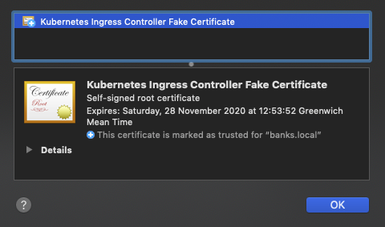

We're going to use the OpenSource [Cert-Manager](https://github.com/jetstack/cert-manager) from JetStack to automate TLS within the cluster.

>cert-manager is a Kubernetes add-on to automate the management and issuance of TLS certificates from various issuing sources.
>
>It will ensure certificates are valid and up to date periodically, and attempt to renew certificates at an appropriate time before expiry.

The [quickstart on Kubernetes](https://cert-manager.io/docs/installation/kubernetes/) guide is a good place to start. Wherever possible we'll look to use the same proposed default settings.

# Install with regular manifests
With helm currently going through some significant changes with the move from v2 to v3 we'll stick with deploying `cert-manager` with regular manifests for now.

Now download and apply the latest manifest.
```bash
mkdir ~/cert-manager; \
cd ~/cert-manager

export CERT_MANAGER_VERSION=v0.12.0
wget https://github.com/jetstack/cert-manager/releases/download/${CERT_MANAGER_VERSION}/cert-manager.yaml
kubectl create -f ~/cert-manager/cert-manager.yaml
```

## Verify the Installation
```bash
$ kubectl -n cert-manager get pods

NAME                                       READY   STATUS    RESTARTS   AGE
cert-manager-5c47f46f57-ldb5v              1/1     Running   0          39s
cert-manager-cainjector-6659d6844d-25mqs   1/1     Running   0          39s
cert-manager-webhook-547567b88f-kvw28      1/1     Running   0          39s
```

We should have three pods running `cert-manager`, `cert-manager-cainjector`, and `cert-manager-webhook`.

# DNS
With an ingress now available, login to your DNS provider (in my case Cloudflare) and point an `A` record for `whoami` to the IP address of the first node.

???+ tip "Wildcard DNS"
    An alternative option (which is what I've gone for below) is to point your `root` `A` record at the IP address (e.g. jamesveitch.dev) and then add a `*` wildcard `CNAME` entry which points at the `root`. This way any arbitrary subdomain (e.g. myapp.jamesveitch.dev) that isn't specifically found as a standalone entry will route straight to wherever the root is pointed.

    The disadvantage of this is that anything not specifically highlighted as a standalone entry will not be proxied through their CDN (see the cloud). We will fix this later though with [ExternalDNS](https://github.com/kubernetes-sigs/external-dns/blob/master/docs/tutorials/cloudflare.md) on Kubernetes. For now it's fine.

    

    NB: I'm using a `CNAME` above for the root which points to an [anondns.net](http://anondns.net) address. This is so I can use a dynamic IP from home. We'll replace this with an `A` record and static IP later when we turn on the cloud node. If you want to stick with a single node at home though you can use my [AnonDNS updater](https://hub.docker.com/repository/docker/saracen9/anondns) docker image to keep your home IP registered for free with anondns.

We'll now deploy a simple `whoami` container and tell the ingress node how to route to it.

```yaml
# file: ~/cert-manager/whoami.yaml
apiVersion: apps/v1
kind: Deployment
metadata:
  name: whoami-deployment
  labels:
    app: whoami
spec:
  replicas: 1
  selector:
    matchLabels:
      app: whoami
  template:
    metadata:
      labels:
        app: whoami
    spec:
      containers:
      - name: whoami
        image: containous/whoami
        ports:
        - containerPort: 80
---
apiVersion: v1
kind: Service
metadata:
  name: whoami
spec:
  selector:
    app: whoami
  ports:
    - protocol: TCP
      port: 80
      targetPort: 80
```

Create the container deployment and service with `kubectl create -f ~/cert-manager/whoami.yaml`. In order to route traffic to this container though we now need to create an ingress resource.

```yaml
# file: ~/cert-manager/whoami-ingress.yaml
apiVersion: networking.k8s.io/v1beta1
kind: Ingress
metadata:
  name: whoami-ingress
  namespace: default
  annotations:
    kubernete.io/ingress.class: nginx
    nginx.ingress.kubernetes.io/rewrite-target: /
    # cert-manager.io/issuer: "letsencrypt-staging"
    # nginx.ingress.kubernetes.io/force-ssl-redirect: "true"
spec:
  #tls:
  #- secretName: whoami-jamesveitch-dev-tls-staging
  #  hosts:
  #  - whoami.jamesveitch.dev
  rules:
  - host: whoami.jamesveitch.dev
    http:
      paths:
      - path: /
        backend:
          serviceName: whoami
          servicePort: 80
```

Apply this with `kubectl apply -f ~/cert-manager/whoami-ingress.yaml`. (Note we use `apply` instead of `create` so we can edit for the TLS later).


To check this is working we can `curl` the address. We should **not** see the same `default backend - 404` response.

```bash
$ curl whoami.jamesveitch.dev

Hostname: whoami-deployment-5b4bb9c787-xfkm2
IP: 127.0.0.1
IP: 10.244.0.104
RemoteAddr: 192.168.0.99:19850
GET / HTTP/1.1
Host: whoami.jamesveitch.dev
User-Agent: curl/7.58.0
Accept: */*
X-Forwarded-For: 82.19.212.223
X-Forwarded-Host: whoami.jamesveitch.dev
X-Forwarded-Port: 80
X-Forwarded-Proto: http
X-Real-Ip: 82.19.212.223
X-Request-Id: 0747f4ec40d196f54151e48014f50383
X-Scheme: http
```

Running this over `https` however yields a problem as we're using a self-signed certificate.

```bash
$ curl https://whoami.jamesveitch.dev

curl: (60) SSL certificate problem: unable to get local issuer certificate
More details here: https://curl.haxx.se/docs/sslcerts.html

curl failed to verify the legitimacy of the server and therefore could not
establish a secure connection to it. To learn more about this situation and
how to fix it, please visit the web page mentioned above.
```



# Configuring an Issuer
As per the [official architecture](https://cert-manager.io/docs/) diagram below Kubernetes has the concept of `Issuers`. Once issued, certificates are then stored in Kubernetes secrets. We're particularly interested in `LetsEncrypt` and `Vault`.


We'll start off using the `http` challenge (which is generic for all providers) and then, later, move to `dns` for `Cloudflare`.

```yaml
# file: ~/cert-manager/letsencrypt-staging.yaml
apiVersion: cert-manager.io/v1alpha2
kind: Issuer
metadata:
  name: letsencrypt-staging
  namespace: default
spec:
  acme:
    # The ACME server URL and email address for ACME registration
    server: https://acme-staging-v02.api.letsencrypt.org/directory
    email: lol@cats.com
    # Name of the secret to store the ACME account private key
    privateKeySecretRef:
      name: letsencrypt-staging-key
    solvers:
    # Enable HTTP01 validations
    - http01:
       ingress:
         class: nginx
``` 

```bash
kubectl create -f ~/cert-manager/letsencrypt-staging.yaml
```

# Obtaining a Certificate for an app
We also now need to create the equivalent of a certificate request for the `whoami` container.

```yaml
# file: ~/cert-manager/whoami-certificate-staging.yaml
apiVersion: cert-manager.io/v1alpha2
kind: Certificate
metadata:
  name: whoami-staging
  namespace: default
spec:
  # Secret names are always required.
  secretName: whoami-jamesveitch-dev-tls-staging
  duration: 2160h # 90d
  renewBefore: 360h # 15d
  organization:
  - jamesveitch
  # The use of the common name field has been deprecated since 2000 and is
  # discouraged from being used.
  commonName: whoami.jamesveitch.dev
  isCA: false
  keySize: 2048
  keyAlgorithm: rsa
  keyEncoding: pkcs1
  usages:
    - server auth
    - client auth
  # At least one of a DNS Name, USI SAN, or IP address is required.
  dnsNames:
  - whoami.jamesveitch.dev
  - www.whoami.jamesveitch.dev
#   uriSANs:
#   - spiffe://cluster.local/ns/sandbox/sa/example
#   ipAddresses:
#   - 192.168.0.5
  # Issuer references are always required.
  issuerRef:
    name: letsencrypt-staging
    # We can reference ClusterIssuers by changing the kind here.
    # The default value is Issuer (i.e. a locally namespaced Issuer)
    kind: Issuer
    # This is optional since cert-manager will default to this value however
    # if you are using an external issuer, change this to that issuer group.
    group: cert-manager.io
```

We'll modify the `ingress` now to uncomment the following lines:

```yaml hl_lines="10 11 13 14 15 16"
# file: ~/cert-manager/whoami-ingress.yaml
apiVersion: networking.k8s.io/v1beta1
kind: Ingress
metadata:
  name: whoami-ingress
  namespace: default
  annotations:
    kubernete.io/ingress.class: nginx
    nginx.ingress.kubernetes.io/rewrite-target: /
    cert-manager.io/issuer: "letsencrypt-staging"
    nginx.ingress.kubernetes.io/force-ssl-redirect: "true"
spec:
  tls:
  - secretName: whoami-jamesveitch-dev-tls-staging
    hosts:
    - whoami.jamesveitch.dev
  rules:
  - host: whoami.jamesveitch.dev
    http:
      paths:
      - path: /
        backend:
          serviceName: whoami
          servicePort: 80
```

Then apply these changes with a `kubectl apply -f ~/cert-manager/whoami-ingress.yaml`

You may need to clear your cache but, navigating to the website should now redirect you automatically to `https` and present you with a LetsEncrypt certificate (albeit an untrusted one from the staging server) as opposed to the previous `Kubernetes Ingress Controller Fake Certificate`.


## LetsEncrypt Production Server
With everything now setup and working we'll replace our `staging` implementation of LetsEncrypt with their `production` service such that our certificates are trusted by default in browsers.

We need to create a new `Issuer` for `LetsEncrypt` and then change both the `cert-request` and `ingress` configurations.

```yaml
# file: ~/cert-manager/letsencrypt.yaml
apiVersion: cert-manager.io/v1alpha2
kind: Issuer
metadata:
  name: letsencrypt
  namespace: default
spec:
  acme:
    # The ACME server URL and email address for ACME registration
    server: https://acme-v02.api.letsencrypt.org/directory
    email: lol@cats.com
    # Name of the secret to store the ACME account private key
    privateKeySecretRef:
      name: letsencrypt-key
    solvers:
    # Enable HTTP01 validations
    - http01:
       ingress:
        class: nginx
``` 

```bash
kubectl create -f ~/cert-manager/letsencrypt.yaml
```

```yaml
# file: ~/cert-manager/whoami-certificate.yaml
apiVersion: cert-manager.io/v1alpha2
kind: Certificate
metadata:
  name: whoami
  namespace: default
spec:
  secretName: whoami-jamesveitch-dev-tls
  duration: 2160h # 90d
  renewBefore: 360h # 15d
  organization:
  - jamesveitch
  commonName: whoami.jamesveitch.dev
  isCA: false
  keySize: 2048
  keyAlgorithm: rsa
  keyEncoding: pkcs1
  usages:
    - server auth
    - client auth
  dnsNames:
  - whoami.jamesveitch.dev
  issuerRef:
    name: letsencrypt
    kind: Issuer
    group: cert-manager.io
```

```bash
kubectl create -f ~/cert-manager/whoami-certificate.yaml
```

```yaml hl_lines="10 14"
# file: ~/cert-manager/whoami-ingress.yaml
apiVersion: networking.k8s.io/v1beta1
kind: Ingress
metadata:
  name: whoami-ingress
  namespace: default
  annotations:
    kubernete.io/ingress.class: nginx
    nginx.ingress.kubernetes.io/rewrite-target: /
    cert-manager.io/issuer: "letsencrypt"
    nginx.ingress.kubernetes.io/force-ssl-redirect: "true"
spec:
  tls:
  - secretName: whoami-jamesveitch-dev-tls-staging
    hosts:
    - whoami.jamesveitch.dev
  rules:
  - host: whoami.jamesveitch.dev
    http:
      paths:
      - path: /
        backend:
          serviceName: whoami
          servicePort: 80
```

```bash
kubectl apply -f ~/cert-manager/whoami-ingress.yaml
```


Cleanup the `whoami` staging resources (but keep the `Issuer`)
```bash
kubectl delete certificate whoami-staging
kubectl delete -f ~/cert-manager/whoami-certificate-staging.yaml
```