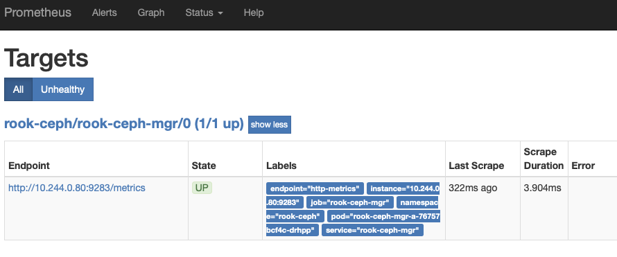
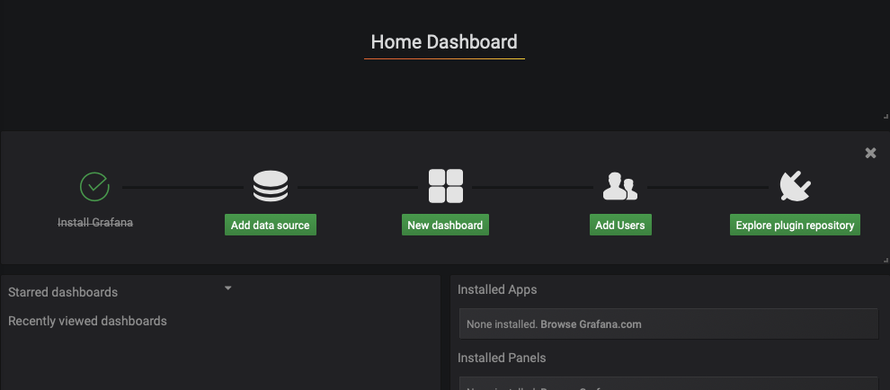
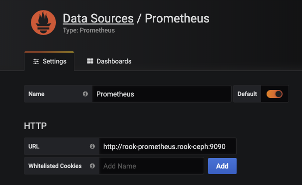
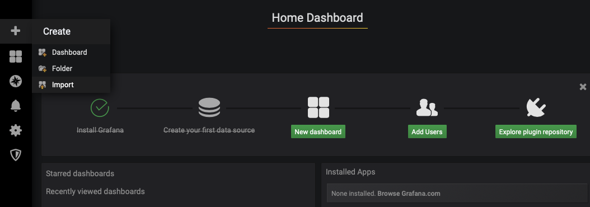
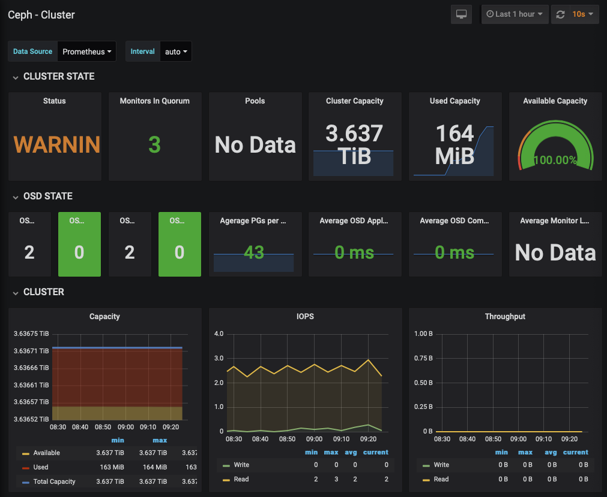

As we've got Ceph (via Rook) installed we'll initially setup Prometheus to monitor metrics and then display them in

# Deploy and configure Prometheus
```bash
mkdir -p ~/monitoring; \
cd ~/monitoring

export OPERATOR_VERSION=v0.34.0

wget https://raw.githubusercontent.com/coreos/prometheus-operator/${OPERATOR_VERSION}/bundle.yaml
kubectl apply -f ~/monitoring/bundle.yaml
```

Then wait for the `prometheus-operator` pod to be Running with `kubectl get pods -w`.

Then we need to configure the Ceph specific configuration: monitoring endpoints, alarm levels etc...
```bash
cd ~/monitoring; \
wget https://raw.githubusercontent.com/packet-labs/Rook-on-Bare-Metal-Workshop/master/configs/ceph-monitoring.yml; \
kubectl apply -f ~/monitoring/ceph-monitoring.yml
```

At this point we should be able to reach the Prometheus UI at:
```bash
IP=$(kubectl get nodes -o jsonpath='{.items[0].status.addresses[].address}')
PORT=$(kubectl -n rook-ceph get svc rook-prometheus -o jsonpath='{.spec.ports[].nodePort}')
echo "Your Prometheus UI is available at: http://$IP:$PORT/"
```

**NB:** This, by default, sets up a NodePort service. We'll fix this later. If you're node is not immediately acessible via the `$IP` then you can check the available addresses for it, maybe choosing to access via the `Hostname` instead.

```bash
$ kubectl get nodes -o json | jq '.items[0].status.addresses[]'

{
  "address": "172.17.0.1",
  "type": "InternalIP"
}
{
  "address": "banks.local",
  "type": "Hostname"
}
```

Head over to `Status` >> `Target` and make sure that the `ceph-mgr` target is `UP`.



Then go to Graph and graph following query `ceph_cluster_total_used_bytes/(1024^3)` to show the total space used in gigabyte over time. Another query of `(ceph_cluster_total_used_bytes / ceph_cluster_total_used_raw_bytes) * 100` will show the % of available space used.

# Install Helm
Irrespective of the method for ultimately exposing the service we'll use helm to install grafana from the stable charts repository.

```bash
# Install helm
export HELM_VERSION=v3.0.0
wget https://get.helm.sh/helm-${HELM_VERSION}-linux-amd64.tar.gz
tar -xvzf helm-${HELM_VERSION}-linux-amd64.tar.gz
chmod +x linux-amd64/helm
sudo mv linux-amd64/helm /usr/local/bin/
rm -rf {helm*,linux-amd64}

# Add repository
helm repo add stable https://kubernetes-charts.storage.googleapis.com/
helm repo update
```
# Install Grafana
As with other services, we can choose to use either a `NodePort` or `Ingress` (via a `ClusterIP`) to expose our services. My preference is the ingress.

```bash tab="ClusterIP" hl_lines="2"
helm install grafana stable/grafana \
  --set service.type=ClusterIP \
  --set persistence.enabled=true \
  --set persistence.type=pvc \
  --set persistence.size=10Gi \
  --set persistence.storageClassName=rook-ceph-block
```

```bash tab="NodePort" hl_lines="2"
helm install grafana stable/grafana \
  --set service.type=NodePort \
  --set persistence.enabled=true \
  --set persistence.type=pvc \
  --set persistence.size=10Gi \
  --set persistence.storageClassName=rook-ceph-block
```

As can be seen we're using persistence with a `pvc` and telling it to use our `rook-ceph-block` storage. You'll get something that look like the below as an output. Follow the instructions.

???+ info
    ```bash
    NAME: grafana
    LAST DEPLOYED: Fri Dec 20 12:28:11 2019
    NAMESPACE: default
    STATUS: deployed
    REVISION: 1
    NOTES:
    1. Get your 'admin' user password by running:

      kubectl get secret --namespace default grafana -o jsonpath="{.data.admin-password}" | base64 --decode ; echo

    2. The Grafana server can be accessed via port 80 on the following DNS name from within your cluster:

      grafana.default.svc.cluster.local

      Get the Grafana URL to visit by running these commands in the same shell:

        export POD_NAME=$(kubectl get pods --namespace default -l "app=grafana,release=grafana" -o jsonpath="{.items[0].metadata.name}")
        kubectl --namespace default port-forward $POD_NAME 3000

    3. Login with the password from step 1 and the username: admin
    ```


Once logged in you'll see a screen similar to below. Hit the `Add data source` and select `Prometheus`. The url needs to be the details we identified above. We'll need the either the `Cluster-IP` or an internal dns reference (i.e `rook-prometheus.rook-ceph`) and `Port` of the service (choose the container port, not the externally exposed one).



```bash
$ kubectl -n rook-ceph get svc rook-prometheus
NAME              TYPE       CLUSTER-IP      EXTERNAL-IP   PORT(S)          AGE
rook-prometheus   NodePort   10.110.175.22   <none>        9090:30900/TCP   16h
```

Hit `Save & Test` and you should hopefully see a `Data source is working` check appear. Hit `Back` to go back to the main screen.




Back on the main screen click on the `+` and select `Import`. Ceph has published some open dashboards with the IDs `2842`, `5336` and `5342`.



NB: On two of the dashboards you need to select `Prometheus` as the datasource.



## Ingress
As the helm chart has already created the `Service` we need to just create an `Ingress` and map it to this and then ensure we request a valid certificate from LetsEncrypt.

```yaml
# file: ~/monitoring/grafana-ingress-https.yaml
apiVersion: networking.k8s.io/v1beta1
kind: Ingress
metadata:
  name: grafana-external-ingress
  namespace: default
  annotations:
    kubernetes.io/ingress.class: "nginx"
    cert-manager.io/issuer: "letsencrypt"
    nginx.ingress.kubernetes.io/force-ssl-redirect: "true"
spec:
  tls:
   - hosts:
     - grafana.jamesveitch.dev
     secretName: grafana.jamesveitch.dev
  rules:
  - host: grafana.jamesveitch.dev
    http:
      paths:
      - path: /
        backend:
          serviceName: grafana
          servicePort: service
---
apiVersion: cert-manager.io/v1alpha2
kind: Certificate
metadata:
  name: grafana
  namespace: default
spec:
  secretName: grafana.jamesveitch.dev
  duration: 2160h # 90d
  renewBefore: 360h # 15d
  organization:
  - jamesveitch
  commonName: grafana.jamesveitch.dev
  isCA: false
  keySize: 2048
  keyAlgorithm: rsa
  keyEncoding: pkcs1
  usages:
    - server auth
    - client auth
  dnsNames:
  - grafana.jamesveitch.dev
  issuerRef:
    name: letsencrypt
    kind: ClusterIssuer
    group: cert-manager.io
```