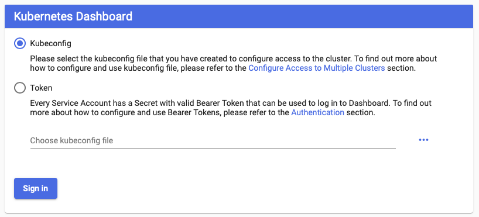
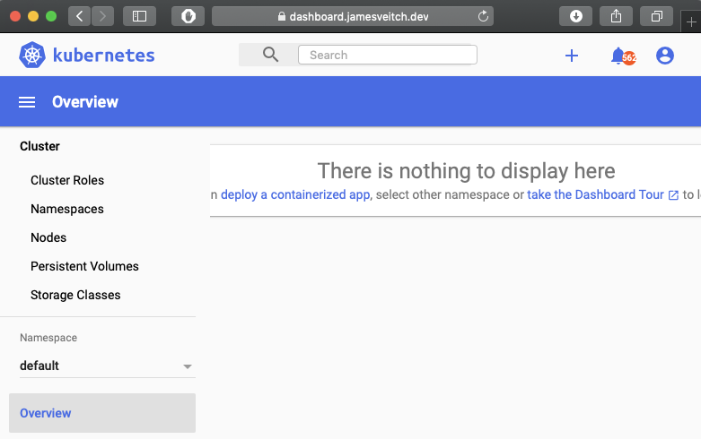
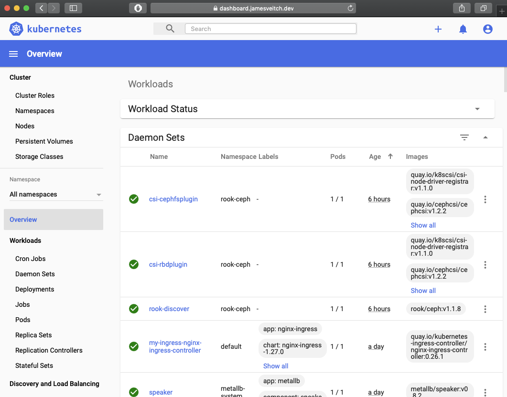

Kubernetes has a [Web UI](https://kubernetes.io/docs/tasks/access-application-cluster/web-ui-dashboard/) that can be turned on and looks like the below.


As it's not deployed by default we'll turn it on. Further docs are available on [GitHub](https://github.com/kubernetes/dashboard). We need to customise the steps though as **by default the documentation installs in an insecure fashion (self-signed certs etc.)**

???+ tip "Notes from repo"
    >Custom certificates have to be stored in a secret named kubernetes-dashboard-certs in the same namespace as Kubernetes Dashboard.

    By default the recommended manifests are the `aio` ones and are found [here](https://github.com/kubernetes/dashboard/tree/master/aio). The [recommended.yaml](https://raw.githubusercontent.com/kubernetes/dashboard/v2.0.0-beta8/aio/deploy/recommended.yaml) is the one the `README.md` will propose. If we want to deploy with authorisation thoguh the [alternative.yaml](https://raw.githubusercontent.com/kubernetes/dashboard/v2.0.0-beta8/aio/deploy/alternative.yaml) should be used.

    We need to review the [Access control](https://github.com/kubernetes/dashboard/blob/master/docs/user/access-control/README.md#authorization-header) part of the docs.

First we should create a namespace for all of our monitoring solutions and then get a LetsEncrypt certificate for the dashboard to consume (as opposed to using some self-signed ones).

```bash
kubectl create namespace monitoring
```

??? example "~/monitoring/kubernetes-dashboard-certificate.yaml"
    ```yaml
    # file: ~/monitoring/kubernetes-dashboard-certificate.yaml
    apiVersion: cert-manager.io/v1alpha2
    kind: Certificate
    metadata:
      name: dashboard
      namespace: monitoring
    spec:
      # Secret names are always required.
      # We should use the name in the docs 
      # https://github.com/kubernetes/dashboard/blob/master/docs/user/installation.md#recommended-setup
      secretName: kubernetes-dashboard-certs
      duration: 2160h # 90d
      renewBefore: 360h # 15d
      organization:
      - jamesveitch
      # The use of the common name field has been deprecated since 2000 and is
      # discouraged from being used.
      commonName: dashboard.jamesveitch.dev
      isCA: false
      keySize: 2048
      keyAlgorithm: rsa
      keyEncoding: pkcs1
      usages:
        - server auth
        - client auth
      # At least one of a DNS Name, USI SAN, or IP address is required.
      dnsNames:
      - dashboard.jamesveitch.dev
    #   uriSANs:
    #   - spiffe://cluster.local/ns/sandbox/sa/example
    #   ipAddresses:
    #   - 192.168.0.5
      # Issuer references are always required.
      issuerRef:
        name: letsencrypt
        # We can reference ClusterIssuers by changing the kind here.
        # The default value is Issuer (i.e. a locally namespaced Issuer)
        kind: ClusterIssuer
        # This is optional since cert-manager will default to this value however
        # if you are using an external issuer, change this to that issuer group.
        group: cert-manager.io
    ```

Obtain with a `kubectl apply -f ~/monitoring/kubernetes-dashboard-certificate.yaml`. Once the certificate has been obtained you should be able to see it as a secret.

??? info "certificate"
    ```bash
    $ kubectl get certificate -n monitoring

    NAME        READY   SECRET                       AGE
    dashboard   True    kubernetes-dashboard-certs   9m18s


    $ kubectl describe secret kubernetes-dashboard-certs -n monitoring

    Name:         kubernetes-dashboard-certs
    Namespace:    monitoring
    Labels:       <none>
    Annotations:  cert-manager.io/alt-names: dashboard.jamesveitch.dev
                  cert-manager.io/certificate-name: dashboard
                  cert-manager.io/common-name: dashboard.jamesveitch.dev
                  cert-manager.io/ip-sans: 
                  cert-manager.io/issuer-kind: ClusterIssuer
                  cert-manager.io/issuer-name: letsencrypt
                  cert-manager.io/uri-sans: 

    Type:  kubernetes.io/tls

    Data
    ====
    ca.crt:   0 bytes
    tls.crt:  3586 bytes
    tls.key:  1679 bytes
    ```

Now grab the manifest and, under the Deployment, section add arguments with the pod definition for the certificates as well as changing the namespace to our `monitoring` one.

```bash
export DASHBOARD_VERSION=v2.0.0-beta8; \
cd ~/monitoring; \
wget https://raw.githubusercontent.com/kubernetes/dashboard/${DASHBOARD_VERSION}/aio/deploy/recommended.yaml

# Replace namespace
sed -i.bak 's/namespace: kubernetes-dashboard/namespace: monitoring/g' ~/monitoring/recommended.yaml

# Replace deployment options for namespace and insert tls
sed -i.bak '/- --auto-generate-certificates/i\            - --tls-cert-file=/tls.crt\n            - --tls-key-file=/tls.key'  ~/monitoring/recommended.yaml
sed -i.bak 's/- --namespace=kubernetes-dashboard/- --namespace=monitoring/g' ~/monitoring/recommended.yaml
```

We'll apply this now (ignore any errors around `The Secret "kubernetes-dashboard-certs" is invalid`). It creates a namespace for `kubernetes-dashboard` by default so we'll also delete that afterwards as it's not needed.

```bash
kubectl apply -f ~/monitoring/recommended.yaml; \
kubectl delete ns kubernetes-dashboard
```

And now create an ingress and matching certificate

```yaml
# file: ~/monitoring/dashboard-ingress-https.yaml
apiVersion: networking.k8s.io/v1beta1
kind: Ingress
metadata:
  name: dashboard-external-ingress
  namespace: monitoring
  annotations:
    kubernetes.io/ingress.class: "nginx"
    cert-manager.io/issuer: "letsencrypt"
    nginx.ingress.kubernetes.io/force-ssl-redirect: "true"
    nginx.ingress.kubernetes.io/backend-protocol: "HTTPS"
    nginx.ingress.kubernetes.io/server-snippet: |
      proxy_ssl_verify off;
spec:
  tls:
   - hosts:
     - dashboard.jamesveitch.dev
     secretName: kubernetes-dashboard-certs
  rules:
  - host: dashboard.jamesveitch.dev
    http:
      paths:
      - path: /
        backend:
          serviceName: kubernetes-dashboard
          servicePort: 443
```

```bash
kubectl apply -f ~/monitoring/dashboard-ingress-https.yaml
```

If all goes well you should now be able to navigate to your dashboard at [dashboard.jamesveitch.dev](https://dashboard.jamesveitch.dev).



Get your token for logging in.

```bash hl_lines="10"
$ kubectl -n monitoring get secret

NAME                               TYPE                                  DATA   AGE
dashboard-jamesveitch-dev          kubernetes.io/tls                     3      40m
dashboard.jamesveitch.dev          kubernetes.io/tls                     3      12m
default-token-xwv2j                kubernetes.io/service-account-token   3      41m
kubernetes-dashboard-certs         kubernetes.io/tls                     3      6m17s
kubernetes-dashboard-csrf          Opaque                                1      3m
kubernetes-dashboard-key-holder    Opaque                                2      3m
kubernetes-dashboard-token-gdf67   kubernetes.io/service-account-token   3      3m


$ kubectl -n monitoring describe secret kubernetes-dashboard-token-gdf67

Name:         kubernetes-dashboard-token-gdf67
Namespace:    monitoring
Labels:       <none>
Annotations:  kubernetes.io/service-account.name: kubernetes-dashboard
              kubernetes.io/service-account.uid: 798c2145-63df-4852-b539-00f897b61e4a

Type:  kubernetes.io/service-account-token

Data
====
ca.crt:     1025 bytes
namespace:  10 bytes
token:      aVeryLongTokenString
```

On logging in there's some good news and bad news...

* Good: We can login with a token and have a nice padlock for TLS via LetsEncrypt
* Bad: It tells us there's nothing running...?!



# Creating an Admin user
Following the guidance in the [docs]() we will create a **sample** admin user. I say sample because we want, wherever possible, our users to be defined in our central Identity Provider (which is going to be setup later on).

```yaml
# file: ~/monitoring/admin-user.yaml
apiVersion: v1
kind: ServiceAccount
metadata:
  name: admin-user
  namespace: monitoring
---
apiVersion: rbac.authorization.k8s.io/v1
kind: ClusterRoleBinding
metadata:
  name: admin-user
roleRef:
  apiGroup: rbac.authorization.k8s.io
  kind: ClusterRole
  name: cluster-admin
subjects:
- kind: ServiceAccount
  name: admin-user
  namespace: monitoring
```

```bash
kubectl apply -f ~/monitoring/admin-user.yaml
```

We can now find the token directly from the commandline.

```bash
kubectl -n monitoring describe secret $(kubectl -n monitoring get secret | grep admin-user | awk '{print $1}')
```

Logging back in as this user we can now see everything in the cluster.

