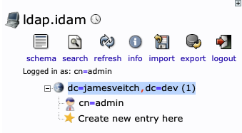
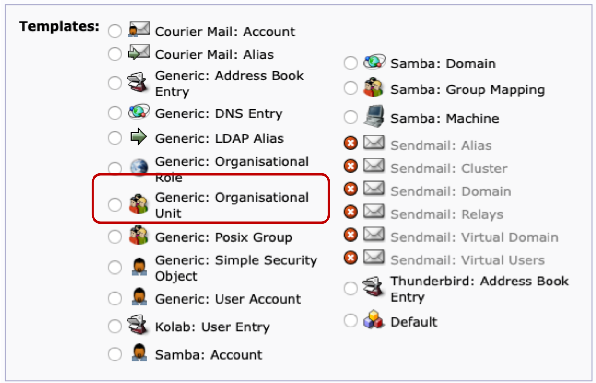
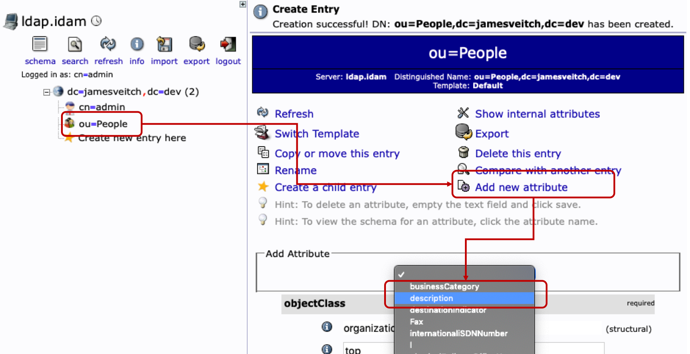
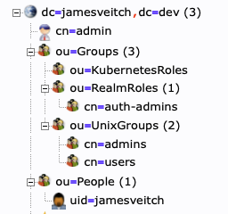
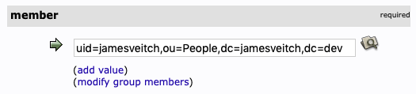
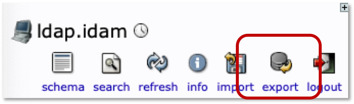
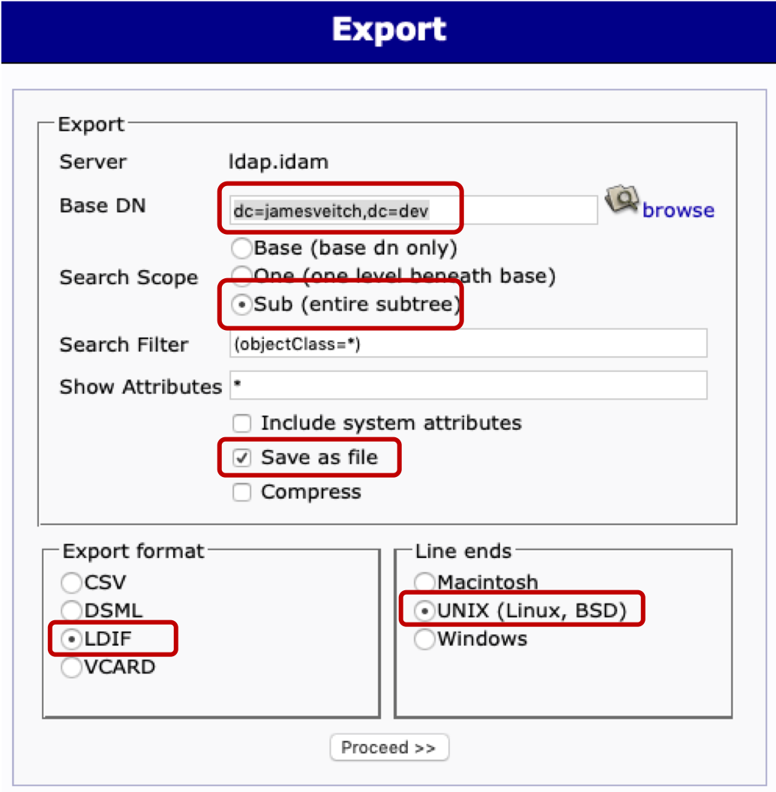

We're going to follow a previous tutorial I wrote for setting up an initial OpenLDAP installation on a VM and then seed an initial admin user. Dockerising this is done now with the `osixia/openldap` base image which can be found on [GitHub](https://github.com/osixia/docker-openldap).		


```bash
# Create our working folder
mkdir -p ~/auth; \
cd ~/auth
```

# Set Secrets
As we're going to have some username/password combinations defined for our authentication services (e.g. database users, root admin users for LDAP and Keycloak etc.) we should store these as `secrets` and then add them into the environment or configuration of the containers in the manifests as references (as opposed to being hardcoded).

There's two options to initially generate and save these secrets. We'll specify to create them only in the `auth` namespace.

```bash tab="Generic CLI"
$ kubectl -n auth create secret generic ldap-user-creds \
      --from-literal=LDAP_ADMIN_PASSWORD=admin \
      --from-literal=LDAP_CONFIG_PASSWORD=config

secret/ldap-user-creds created
```

```bash tab="Using Manifest"
# We should `base64` encode the secrets first.
$ echo -n 'admin' | base64

YWRtaW4=

$ echo -n 'config' | base64

Y29uZmln

---
# Now use these base64 secrets in the manifest
---
# file: ~/auth/ldap-user-creds-secret.yaml
apiVersion: v1
kind: Secret
metadata:
  name: ldap-user-creds
  namespace: auth
type: Opaque
data:
  LDAP_ADMIN_PASSWORD: YWRtaW4=
  LDAP_CONFIG_PASSWORD: Y29uZmln
```

For either of the above methods for storing the secret you then access the key,value combinations in the deployment manifest like follows:


```yaml tab="envFrom"
envFrom:
  # Secrets
  - secretRef:
      name: ldap-user-creds
  # Normal plaintext config
  - configMapRef:
      name: ldap-config
```

```yaml tab="env"
env:
  - name: LDAP_ADMIN_PASSWORD
    valueFrom:
      secretKeyRef:
        name: ldap-user-creds
        key: password
  - name: LDAP_CONFIG_PASSWORD
    valueFrom:
      secretKeyRef:
        name: ldap-user-creds
        key: LDAP_CONFIG_PASSWORD
```

# Installation
??? warning "posixGroup, groupOfNames or groupOfUniqueNames"
    I went down the rabbithole all the way back to the [2006 mailing list](https://www.mail-archive.com/ldap@listserver.itd.umich.edu/msg00322.html) in order to work out what the accepted wisdom is for creating user groups and then ensuring referential integrity with a backref on the user object.

    As per the [official docs]() it turns out there's a `memberOf` attribute that can be maintained on an object to show what groups they are members of. Sounds simple?

    >In some scenarios, it may be desirable for a client to be able to determine which groups an entry is a member of, without performing an additional search. Examples of this are applications using the DIT for access control based on group authorization.

    >The memberof overlay updates an attribute (by default memberOf) whenever changes occur to the membership attribute (by default member) of entries of the objectclass (by default groupOfNames) configured to trigger updates.

    >Thus, it provides maintenance of the list of groups an entry is a member of, when usual maintenance of groups is done by modifying the members on the group entry.

    It's actually, genuinely, rocket science to get anything like this properly working (or even find some docs that explain it). In order to enable this functionality I found you need to modify the OpenLDAP installation to specifically ask for memberships to be maintained.

    ```ldif
    # file: ~/auth/memberOf.ldif
    dn: olcOverlay=memberof,olcDatabase={1}mdb,cn=config
    objectClass: olcOverlayConfig
    objectClass: olcMemberOf
    olcOverlay: memberof
    olcMemberOfRefint: TRUE
    ```

    You can apply this manually with `ldapadd -Y EXTERNAL -H ldapi:/// -f memberOf.ldif` or, as explained in the docker image notes, we can [Seed the ldap database with a ldif](https://github.com/osixia/docker-openldap#seed-ldap-database-with-ldif).

    We need to add this file into the `/container/service/slapd/assets/config/bootstrap/ldif/custom` and then add `--copy-service` to the startup args of the container. In the world of Kubernetes this means mounting via a ConfigMap.

    ```yaml
    apiVersion: v1
    kind: ConfigMap
    metadata:
      name: memberof-config
      namespace: auth
    data:
      memberOf.ldif: |
        dn: olcOverlay=memberof,olcDatabase={1}mdb,cn=config
        objectClass: olcOverlayConfig
        objectClass: olcMemberOf
        olcOverlay: memberof
        olcMemberOfRefint: TRUE
    ```

    **Note:** I’m using the name of the file as the key.

    We can then add this into the `volumes` and `volumeMounts` of the container.

    ??? example "container"

        ```yaml hl_lines="5 22 23 24 37 38 39"
        ...
        containers:
          - name: ldap
            image: osixia/openldap
            args: ["--copy-service"]
            envFrom:
            - configMapRef:
                name: ldap-config
            ports:
            - containerPort: 389
              name: ldap
            - containerPort: 636
              name: ldaps
            volumeMounts:
            - name: ldap-data
              mountPath: /var/lib/ldap
            - name: ldap-config
              mountPath: /etc/ldap/slapd.d
            - name: ldap-certs
              mountPath: /container/service/slapd/assets/certs
            - name: memberof-config
              mountPath: /container/service/slapd/assets/config/bootstrap/ldif/custom/memberOf.ldif
              subPath: memberOf.ldif
            - name: container-run
              mountPath: /container/run
          volumes:
          - name: ldap-data
            persistentVolumeClaim:
              claimName: ldap-data-pv-claim
          - name: ldap-config
            persistentVolumeClaim:
              claimName: ldap-config-pv-claim
          - name: ldap-certs
            persistentVolumeClaim:
              claimName: ldap-certs-pv-claim
          - name: memberof-config
            configMap:
              name: memberof-config
          - name: container-run
            emptyDir: {}
        ...
        ```

    **Note:** the volume references the ConfigMap (memberof-config), the volume mount specifies the mountPath as the file you want to replace (/container/service/slapd/assets/config/bootstrap/ldif/custom/memberOf.ldif) and the subPath property is used to reference the file by key from the ConfigMap `data` (memberOf.ldif).

The final manifest we end up with is below.

??? example "OpenLDAP manifest"

    ```yaml
    # file: ~/auth/ldap.yaml
    apiVersion: v1
    kind: ConfigMap
    metadata:
      name: memberof-config
      namespace: auth
    data:
      memberOf.ldif: |
        dn: olcOverlay=memberof,olcDatabase={1}mdb,cn=config
        objectClass: olcOverlayConfig
        objectClass: olcMemberOf
        olcOverlay: memberof
        olcMemberOfRefint: TRUE
    ---
    apiVersion: v1
    kind: ConfigMap
    metadata:
      name: ldap-config
      namespace: auth
      labels:
        app: ldap
        tier: backend
    data:
      LDAP_ORGANISATION: James Veitch
      LDAP_DOMAIN: jamesveitch.dev
    ---
    apiVersion: v1
    kind: PersistentVolumeClaim
    metadata:
      name: ldap-data-pv-claim
      namespace: auth
      labels:
        app: ldap
        tier: backend
    spec:
      accessModes:
      - ReadWriteOnce
      resources:
        requests:
          storage: 20Gi
    ---
    apiVersion: v1
    kind: PersistentVolumeClaim
    metadata:
      name: ldap-config-pv-claim
      namespace: auth
      labels:
        app: ldap
        tier: backend
    spec:
      accessModes:
      - ReadWriteOnce
      resources:
        requests:
          storage: 1Gi
    ---
    apiVersion: v1
    kind: PersistentVolumeClaim
    metadata:
      name: ldap-certs-pv-claim
      namespace: auth
      labels:
        app: ldap
        tier: backend
    spec:
      accessModes:
      - ReadWriteOnce
      resources:
        requests:
          storage: 1Gi
    ---
    apiVersion: v1
    kind: Service
    metadata:
      name: ldap
      namespace: auth
      labels:
        app: ldap
        tier: backend
    spec:
      selector:
        app: ldap
        tier: backend
      ports:
        - name: ldap
          protocol: TCP
          port: 389
          targetPort: 389
        - name: ldaps-tcp
          protocol: TCP
          port: 636
          targetPort: 636
        - name: ldaps
          protocol: UDP
          port: 636
          targetPort: 636
    ---
    apiVersion: apps/v1
    kind: Deployment
    metadata:
      name: ldap-deployment
      namespace: auth
      labels:
        app: ldap
        tier: backend
    spec:
      replicas: 1
      selector:
        matchLabels:
          app: ldap
          tier: backend
      strategy:
        type: Recreate
      template:
        metadata:
          labels:
            app: ldap
            tier: backend
        spec:
          containers:
          - name: ldap
            image: osixia/openldap
            args: ["--copy-service"]
            env:
              - name: LDAP_ADMIN_PASSWORD
                valueFrom:
                  secretKeyRef:
                    name: ldap-user-creds
                    key: password
              - name: LDAP_CONFIG_PASSWORD
                valueFrom:
                  secretKeyRef:
                    name: ldap-user-creds
                    key: LDAP_CONFIG_PASSWORD
            envFrom:
            - configMapRef:
                name: ldap-config
            ports:
            - containerPort: 389
              name: ldap
            - containerPort: 636
              name: ldaps
            volumeMounts:
            - name: ldap-data
              mountPath: /var/lib/ldap
            - name: ldap-config
              mountPath: /etc/ldap/slapd.d
            - name: ldap-certs
              mountPath: /container/service/slapd/assets/certs
            - name: memberof-config
              mountPath: /container/service/slapd/assets/config/bootstrap/ldif/custom/memberOf.ldif
              subPath: memberOf.ldif
            - name: container-run
              mountPath: /container/run
          volumes:
          - name: ldap-data
            persistentVolumeClaim:
              claimName: ldap-data-pv-claim
          - name: ldap-config
            persistentVolumeClaim:
              claimName: ldap-config-pv-claim
          - name: ldap-certs
            persistentVolumeClaim:
              claimName: ldap-certs-pv-claim
          - name: memberof-config
            configMap:
              name: memberof-config
          - name: container-run
            emptyDir: {}
    ```

Apply this manifest with a `kubectl apply -f ~/auth/ldap.yaml` and then wait for the services and pods to spin up.

```bash
$ kubectl apply -f ldap.yaml 

configmap/memberof-config created
configmap/ldap-config created
persistentvolumeclaim/ldap-data-pv-claim created
persistentvolumeclaim/ldap-config-pv-claim created
persistentvolumeclaim/ldap-certs-pv-claim created
service/ldap created
deployment.apps/ldap-deployment created
```

We've created 

# Admin
If you haven't used a pre-canned LDIF file to seed the initial database we can use a friendly admin tool to quickly add some content into the LDAP backend.

??? example "LDAP Admin manifest"

    ```yaml
    # file: ~/auth/ldap-admin.yaml
    apiVersion: v1
    kind: ConfigMap
    metadata:
      name: ldapadmin-config
      namespace: auth
      labels:
        app: ldap
        tier: frontend
    data:
      PHPLDAPADMIN_LDAP_HOSTS: "ldap.auth"
      PHPLDAPADMIN_HTTPS: "false"
    ---
    apiVersion: v1
    kind: Service
    metadata:
      name: ldapadmin
      namespace: auth
      labels:
        app: ldap
        tier: frontend
    spec:
      type: LoadBalancer
      selector:
        app: ldap
        tier: frontend
      ports:
        - name: http
          protocol: TCP
          port: 80
          targetPort: 80
    ---
    apiVersion: apps/v1
    kind: Deployment
    metadata:
      name: ldapadmin-deployment
      namespace: auth
      labels:
        app: ldap
        tier: frontend
    spec:
      replicas: 1
      selector:
        matchLabels:
          app: ldap
          tier: frontend
      strategy:
        type: Recreate
      template:
        metadata:
          labels:
            app: ldap
            tier: frontend
        spec:
          containers:
          - name: ldapadmin
            image: osixia/phpldapadmin
            envFrom:
            - configMapRef:
                name: ldapadmin-config
            ports:
            - containerPort: 80
              name: http
    ```

This creates an internal (to the LAN) `Service` using a `LoadBalancer` so it appears on the network via MetalLB. To get the `External-IP` query the services in the namespace.

```bash hl_lines="5"
$ kubectl get svc -n auth

NAME          TYPE           CLUSTER-IP      EXTERNAL-IP     PORT(S)                   AGE
ldap          ClusterIP      10.96.236.102   <none>          389/TCP,636/TCP,636/UDP   14h
ldapadmin     LoadBalancer   10.96.165.63    192.168.0.201   80:30158/TCP              14h
```

To login to the admin panel you'll need to use the username of `cn=admin,dc=jamesveitch,dc=dev` and then the password.

One the left you should see something similar to the below. Click to `Create new entry here` so we can add the necessary Organisational Units we'll require later on.



In the screen that appears choose `Generic: Organisational Unit` and then call it `People`. Click through the screens and commit to the database.

??? tip "Generic: Organisational Unit"
    

If you click on this new `ou=People` icon and then `Add new attribute` you'll see down the bottom we can select `description` from a drop-down box. Type in something descriptive.

>LDAP tree where users are

??? tip "Add description"
    

## Additional entries
After adding the above, we need to create the following structure, in the following order (LDAP is massively fiddly...). Alternatively you can just import this example "Structure" via the "Import" functionality.

??? example "Structure LDIF"

    ```yaml
    # Entry 1: dc=jamesveitch,dc=dev
    dn: dc=jamesveitch,dc=dev
    dc: jamesveitch
    o: James Veitch
    objectclass: top
    objectclass: dcObject
    objectclass: organization

    # Entry 2: cn=admin,dc=jamesveitch,dc=dev
    dn: cn=admin,dc=jamesveitch,dc=dev
    cn: admin
    description: LDAP administrator
    objectclass: simpleSecurityObject
    objectclass: organizationalRole
    userpassword: {SSHA}4hUwwQ1QLcRt1V2nIx1tsoVQ7uoSXvh4

    # Entry 3: ou=Groups,dc=jamesveitch,dc=dev
    dn: ou=Groups,dc=jamesveitch,dc=dev
    objectclass: organizationalUnit
    objectclass: top
    ou: Groups

    # Entry 4: ou=KubernetesRoles,ou=Groups,dc=jamesveitch,dc=dev
    dn: ou=KubernetesRoles,ou=Groups,dc=jamesveitch,dc=dev
    objectclass: organizationalUnit
    objectclass: top
    ou: KubernetesRoles

    # Entry 5: ou=RealmRoles,ou=Groups,dc=jamesveitch,dc=dev
    dn: ou=RealmRoles,ou=Groups,dc=jamesveitch,dc=dev
    objectclass: organizationalUnit
    objectclass: top
    ou: RealmRoles

    # Entry 6: ou=UnixGroups,ou=Groups,dc=jamesveitch,dc=dev
    dn: ou=UnixGroups,ou=Groups,dc=jamesveitch,dc=dev
    objectclass: organizationalUnit
    objectclass: top
    ou: UnixGroups

    # Entry 7: cn=admins,ou=UnixGroups,ou=Groups,dc=jamesveitch,dc=dev
    dn: cn=admins,ou=UnixGroups,ou=Groups,dc=jamesveitch,dc=dev
    cn: admins
    gidnumber: 500
    objectclass: posixGroup
    objectclass: top

    # Entry 8: cn=users,ou=UnixGroups,ou=Groups,dc=jamesveitch,dc=dev
    dn: cn=users,ou=UnixGroups,ou=Groups,dc=jamesveitch,dc=dev
    cn: users
    gidnumber: 501
    objectclass: posixGroup
    objectclass: top

    # Entry 9: ou=People,dc=jamesveitch,dc=dev
    dn: ou=People,dc=jamesveitch,dc=dev
    objectclass: organizationalUnit
    objectclass: top
    ou: People
    ```

* `Organisational Units`: Create these in the same way as above (`Generic: Organisational Unit` and then add a description attribute).
    * `People`: LDAP tree where users are
    * `Groups`: LDAP tree for Groups that users belong to
        * `RealmRoles`: Keycloak roles that users have
        * `KubernetesRoles`: Kubernetes roles that users have
        * `UnixGroups`: Contains groups for posix systems
* `PosixGroups`: These sit inside the `UnixGroups` OU tree and should be created as a `Posix Group`.
    * `users`: Standard group for all users
    * `admins`: Holds general administrators for the domain
    * `auth-admins`: Sits inside `RealmRoles` OU. Administrators for Keycloak and LDAP
    * `cluster-admins`: Sits inside `KubernetesRoles` OU. Administrators for the Kubernetes Cluster
* `Users`: These sit inside the `People` OU tree and should be created as a `Default` --> `posixAccount` type. **See below section on `User Attributes` before proceeding.**
* `General Role Groups`: these sit inside the `Groups` OUT and should be created as `Default` --> `groupOfNames`. Select `cn` as the `RDN` option from the drop-down. **These can only be created after an initial user** (as they have a hard requirement to have a user in them).
    * `auth-admins`: Sits inside the `RealmRoles` OU tree. Holds administrators for Keycloak and LDAP

???+ warning "User Attributes"
    As I couldn't get the provided templates to properly generate a suitable object for users I ended up handcrafting one. Just copy this into the "Import" and adjust as necessary.

    ```yaml
    # Create User
    dn: uid=jamesveitch,ou=People,dc=jamesveitch,dc=dev
    objectClass: inetOrgPerson
    objectClass: posixAccount
    objectClass: shadowAccount
    objectclass: top
    uid: jamesveitch
    givenName: James
    cn: James
    sn: Veitch
    displayName: James Veitch
    uidNumber: 1000
    gidNumber: 500
    userPassword: password
    gecos: James Veitch
    loginShell: /bin/bash
    homeDirectory: /home/users/james
    # Group memberships
    memberOf: cn=admins,ou=UnixGroups,ou=Groups,dc=jamesveitch,dc=dev
    memberOf: cn=users,ou=UnixGroups,ou=Groups,dc=jamesveitch,dc=dev
    ```

    



Make note of your user's `Distinguished Name` (DN) as we need this. It will look something like `uid=jamesveitch,ou=People,dc=jamesveitch,dc=dev`. Now go into each of `users`, `admins` and `auth-admins` Groups and add our user into them with `Add new attribute` --> `memberUid` and use the DN.



# Export configuration as LDIF
The *really* helpful thing about this admin interface is that it contains an `Export` functionality we can use to save down a copy of our databse for subsequent seeding / backup.

Make sure you set the following:

* `Base DN`: use the root `dc=jamesveitch,dc=dev`
* `Search Scope`: Select the entire subtree
* `Attributes`: Keep the wildcard `*`
* `Save as file`: Select this
* `Export format`: LDIF
* `Line ends`: UNIX

??? tip "Export"
    
    


#TODO: Seed the database with an LDIF
See [seed-ldap-database-with-ldif](https://github.com/osixia/docker-openldap#seed-ldap-database-with-ldif) from the docs.