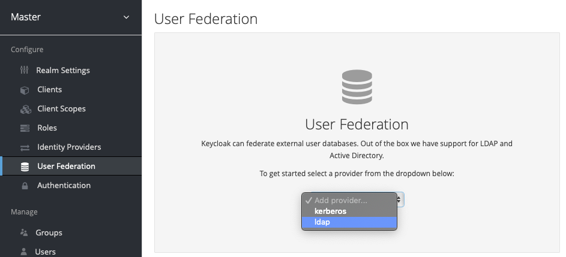
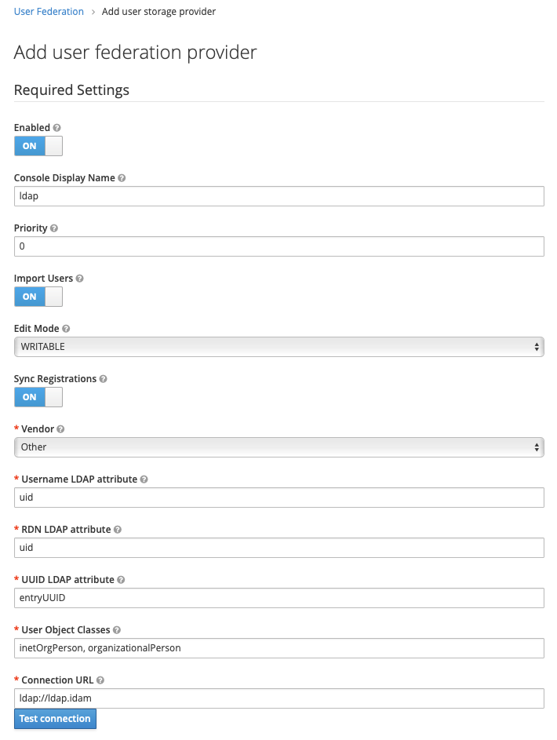
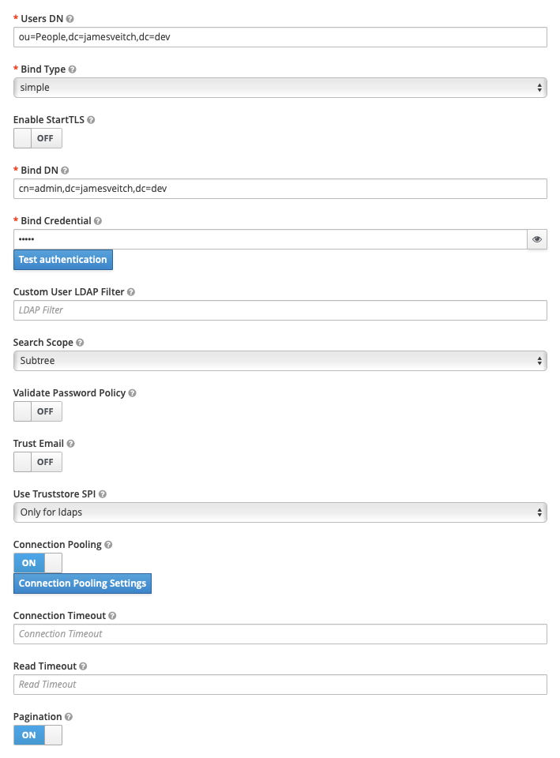
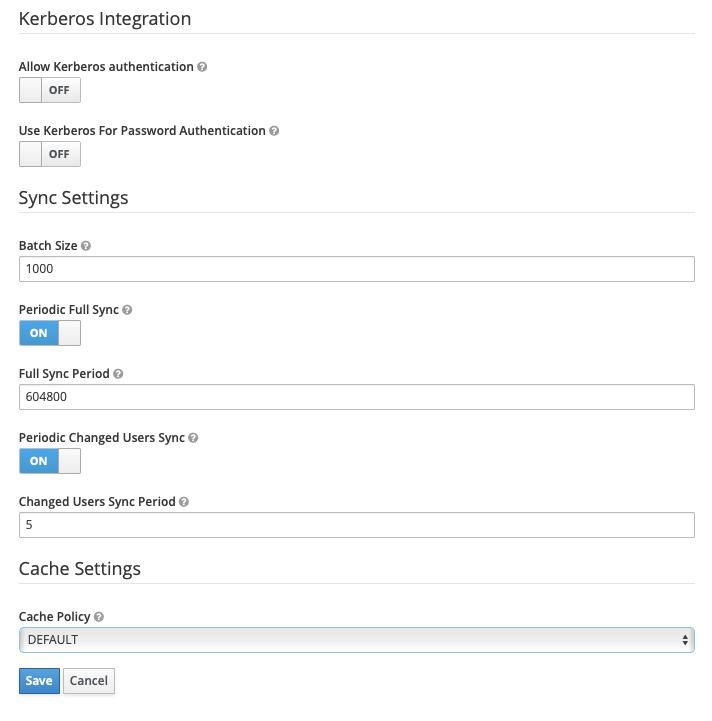
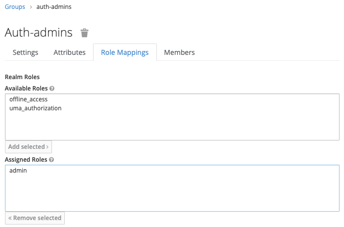
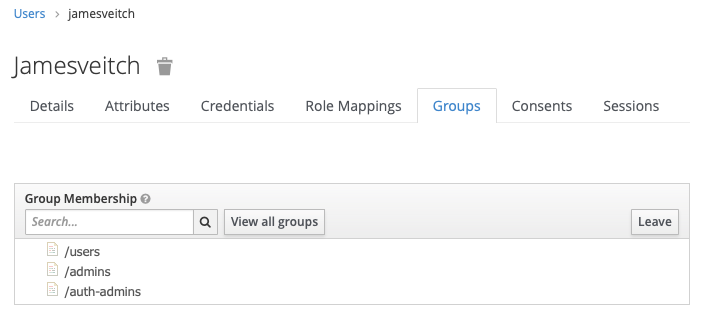
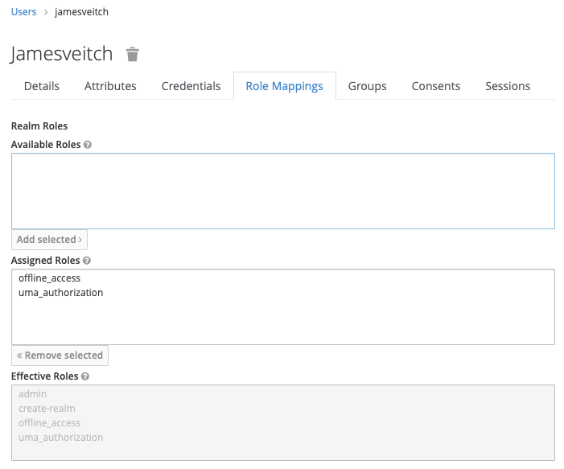

We need the following:

* keycloak
* postgres
* postgres (backup)

Documentation is available on [Docker Hub](https://hub.docker.com/r/jboss/keycloak)

# Deploy Keycloak

??? example "Keycloak manifest"

    ```yaml
    # file: ~/idam/keycloak.yaml
    apiVersion: cert-manager.io/v1alpha2
    kind: Certificate
    metadata:
      name: keycloak
      namespace: idam
    spec:
      secretName: keycloak-certs
      duration: 2160h # 90d
      renewBefore: 360h # 15d
      organization:
      - jamesveitch
      commonName: auth.jamesveitch.dev
      isCA: false
      keySize: 2048
      keyAlgorithm: rsa
      keyEncoding: pkcs1
      usages:
        - server auth
        - client auth
      dnsNames:
      - auth.jamesveitch.dev
      issuerRef:
        name: letsencrypt
        kind: ClusterIssuer
        group: cert-manager.io
    ---
    apiVersion: networking.k8s.io/v1beta1
    kind: Ingress
    metadata:
      name: keycloak-external-ingress
      namespace: idam
      labels:
        app: keycloak
        tier: frontend
      annotations:
        kubernetes.io/ingress.class: "nginx"
        cert-manager.io/issuer: "letsencrypt"
        nginx.ingress.kubernetes.io/force-ssl-redirect: "true"
    spec:
      tls:
      - hosts:
        - auth.jamesveitch.dev
        secretName: keycloak-certs
      rules:
      - host: auth.jamesveitch.dev
        http:
          paths:
          - path: /
            backend:
              serviceName: keycloak
              servicePort: 8080
    ---
    apiVersion: v1
    kind: Service
    metadata:
      name: keycloak
      namespace: idam
      labels:
        app: keycloak
        tier: frontend
    spec:
      selector:
        app: keycloak
        tier: frontend
      ports:
        - name: http
          protocol: TCP
          port: 8080
          targetPort: 8080
    ---
    apiVersion: v1
    kind: ConfigMap
    metadata:
      name: keycloak-config
      namespace: idam
      labels:
        app: keycloak
        tier: frontend
    data:
      DB_ADDR: keycloak-db.idam
      DB_USER: postgres
      DB_PASSWORD: postgres
      KEYCLOAK_USER: admin
      KEYCLOAK_PASSWORD: password
      # This is required to run keycloak behind a service,ingress etc		
      PROXY_ADDRESS_FORWARDING: "true"
    ---
    apiVersion: apps/v1
    kind: Deployment
    metadata:
      name: keycloak-deployment
      namespace: idam
      labels:
        app: keycloak
        tier: frontend
    spec:
      replicas: 1
      selector:
        matchLabels:
          app: keycloak
          tier: frontend
      strategy:
        type: Recreate
      template:
        metadata:
          labels:
            app: keycloak
            tier: frontend
        spec:
          containers:
          - name: keycloak
            image: jboss/keycloak
            envFrom:
            - configMapRef:
                name: keycloak-config
            ports:
            - containerPort: 8080
              name: keycloak
    ---
    apiVersion: v1
    kind: ConfigMap
    metadata:
      name: keycloak-db-config
      namespace: idam
      labels:
        app: keycloak
        tier: postgres
    data:
      POSTGRES_USER: postgres
      POSTGRES_PASSWORD: postgres
      POSTGRES_DB: keycloak
      PGDATA: /var/lib/postgresql/data/pgdata
    ---
    apiVersion: v1
    kind: PersistentVolumeClaim
    metadata:
      name: keycloak-db-data-pv-claim
      namespace: idam
      labels:
        app: keycloak
        tier: postgres
    spec:
      accessModes:
      - ReadWriteOnce
      resources:
        requests:
          storage: 20Gi
    ---
    apiVersion: v1
    kind: PersistentVolumeClaim
    metadata:
      name: keycloak-db-config-pv-claim
      namespace: idam
      labels:
        app: keycloak
        tier: postgres
    spec:
      accessModes:
      - ReadWriteOnce
      resources:
        requests:
          storage: 1Gi
    ---
    apiVersion: v1
    kind: Service
    metadata:
      name: keycloak-db
      namespace: idam
      labels:
        app: keycloak
        tier: postgres
    spec:
      selector:
        app: keycloak
        tier: postgres
      ports:
        - name: postgres
          protocol: TCP
          port: 5432
          targetPort: 5432
    ---
    apiVersion: apps/v1
    kind: Deployment
    metadata:
      name: keycloak-db-deployment
      namespace: idam
      labels:
        app: keycloak
        tier: postgres
    spec:
      replicas: 1
      selector:
        matchLabels:
          app: keycloak
          tier: postgres
      strategy:
        type: Recreate
      template:
        metadata:
          labels:
            app: keycloak
            tier: postgres
        spec:
          containers:
          - name: keycloak-db
            image: postgres:alpine
            envFrom:
            - configMapRef:
                name: keycloak-db-config
            ports:
            - containerPort: 5432
              name: postgres
            volumeMounts:
            - name: keycloak-db-data
              mountPath: /var/lib/postgresql/data
            - name: keycloak-db-config
              mountPath: /usr/share/postgresql
          volumes:
          - name: keycloak-db-data
            persistentVolumeClaim:
              claimName: keycloak-db-data-pv-claim
          - name: keycloak-db-config
            persistentVolumeClaim:
              claimName: keycloak-db-config-pv-claim
    ```

Apply the manifest with `kubectl apply -f ~/idam/keycloak.yaml` and then wait for the pods, services, ingress and certificate to be provisioned. The keycloak container can take up to a minute to properly start up so you can monitor this be looking at the logs for the `keycloak-deployment*` pod.

```bash hl_lines="5"
$ kubectl get pod -n idam

NAME                                      READY   STATUS    RESTARTS   AGE
keycloak-db-deployment-5d8846dbf9-2dfdh   1/1     Running   0          14h
keycloak-deployment-88bc75877-f8cbr       1/1     Running   0          14h
ldap-deployment-7864dd96cf-9jvmz          1/1     Running   0          15h
ldapadmin-deployment-7575c6d9dc-vb47b     1/1     Running   0          15h

$ kubectl -n idam logs keycloak-deployment-88bc75877-f8cbr
```

# User Federation Identity Provider (LDAP)
To configure Keycloak to work with OpenLDAP we need to login and setup our `ldap` container as a `User Federation` provider. For the moment we will use the `Master` realm but, if wanted, you could create a new realm and perform this inside.



## Settings
Key settings you'll need are as follows:

* `Vendor`: Other
* `Edit Mode`: WRITABLE
* `Connection URL`: ldap://ldap.idam
* `Users DN`: ou=People,dc=jamesveitch,dc=dev
* `Bind DN`: cn=admin,dc=jamesveitch,dc=dev
* `Bind Credential`: <insert admin password>

<!-- #TODO: Implement StartTLS with trusted certs -->

??? example "Identity Provider Configuration (Settings)"
    
    
    

## Mappers
Mappers help to provide a translation layer between how data is stored in the provider and how we'd like to use it in Keycloak. For example, there are some standard ones created for you automatically based on your selection of the `Vendor` in the previous `Settings` tab.


Clicking on the `username` will show you that:

* `Type`: It's a `user-attribute` mapper (used to map a single attribute from a LDAP user to the Keycloak user model)
* `Model Attribute`: This is what the attribute will be called in Keycloak
* `LDAP Attribute`: What the attribute is called in LDAP

??? example "Username attribute-ldap-mapper"
    

We are going to add some of our own custom mappers so that we can do things like identify what security groups a user is part of and, therefore, what resources they should be able to access inside Kubernetes.

First though a couple of the defaults need tweaking.

* `First Name`: Currently points at our `cn` for our users and this will pull back `James Veitch`. We need to modify, per our LDAP schema, to use `givenName` instead as the `LDAP Attribute`.


# Create Groups and Mappers
One of the great things about Keycloak is you can also use it as a frontend to edit back into the LDAP database (without needing a separate `phpldapadmin` deployment - you'll still need this for managing things like OUs and other structural items).

As we created a number of Groups [in our previous step](../01.openldap#admin) (or have seeded with an LDIF) we need to tell Keycloak how to find and interpret them.

Go back into our `User Federation` --> `Ldap` --> `Mappers` and create a new one.

* `Name`: posix groups
* `Type`: group-ldap-mapper
* `LDAP Groups DN`: ou=Groups,dc=jamesveitch,dc=dev
* `Group Object Classes`: posixGroup
* `Membership LDAP Attribute`: memberuid

Click on the `Sync LDAP Groups To Keycloak` button down the bottom and ensure you get a success overlay message that it's now imported the Groups we created earlier (3 of them). Go to the `Settings` tab and then, down the bottom, click `Synchronize all users` to get a message about one user being updated (because it's now spotted some groups we're part of).

## Groups
Go to `Groups`. You should see 4 items for our `People` OU and then the 3 groups we created.

Double-click on `auth-admins` to edit it and select `Role Mappings`. Add the `admin` role from `Available Roles` to the `Assigned Roles`. You'll see this now gives use some `Effective Roles` to create a new realm or administrate one.

??? example "Group Role Mappings"
    

## Users
If you now go to `Users` and select you user yo should note on the `Groups` tab you have a `Group Membership` identified for all of the groups you're part of. In addition you have `admin` as an `Effective Role` in the `Role Mappings` tab because it's mapped this through from your membership of the `auth-admins` group.

Go to `Users` and then click `View all users` to force it to perform an initial sync. You should see something similar to the below with an initial `admin` user (if using Master realm).

??? example "User: Group Membership"
    

??? example "User: Role Mapping"
    


# Bootstrapping
We'll, later, bootstrap this into Keycloak via the [Importing a realm](https://github.com/jboss-dockerfiles/keycloak/tree/master/server#importing-a-realm) option. The easiest way to get your configuration back out of the system is to go the `Export` setting and then get the JSON output.

Unfortunately, due to the way in which the image is configured, the given method in the docs doesn't work (as volumes are mounted by `root` yet the application executes as the `jboss` user and therefore can't access the files). As a result we'll inherit from and build a custom image with a `/realms` folder that we can mount the JSON files into. #TODO: update with custom image.


# Enabling MFA
Stealing with pride from documentation elsewhere we're going to enable TOTP based MFA for our initial user.

In the GUI you would navigate to `Authentication` --> `OTP Policy` and then update the following settings as required. The below are those we're using:

* `OTP Type`: Time Based
* `OTP Hash Algorith`: SHA512
* `Number of Digits`: 8
* `Look Ahead Window`: 3
* `OTP Token Period`: 30

Depending on appetite we can also navigate to the `Authentication` --> `Required Actions` tab and tick the `Default Action` box against `Configure OTP` if we want to enforce this for everyone by default.

## Impersonate user
Navigate to `Users` and then select `Impersonate` next to ours. This should change and give you a different screen where we can now setup MFA for our user. Select the `Authenticator` option and follow the instructions to get setup.

## Login
Logout using the `Sign Out` button in the top right of the screen and then attempt to sign back in with your new user. You'll be presented with the below requiring you to input a code from your app.


# Accessing account and admin console
The admin console and account details can be accessed from the following urls:

* [Security Admin Console](http://keycloak.jamesveitch.local:8080/auth/admin/homelab/consoledevindex.html)
* [Account](http://keycloak.jamesveitch.local:8080/auth/realms/homelab/accountdev