[Keycloak](https://www.keycloak.org) is an application from Red Hat which allows you to provide a variety of authentication options to applications you run from a single source. It also includes User Federation, Identity Brokering and Social Login.

Here's a picture of the current capabilities advertised on their website.

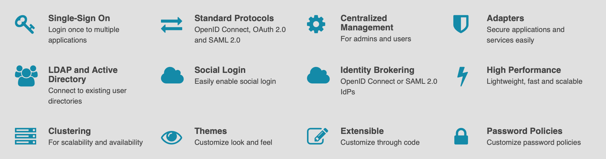

Whilst we *could* link Keycloak to a provider like GitHub (which would allow you to login to other applications with your GitHub username/password combination), instead we're going to manage our own users and Groups in OpenLDAP and have Keycloak sat in front of this directory server. This provides us much more scalability, control and flexibility.

In order to deploy and run Keycloak we need the following:

* keycloak
* postgres

Documentation is available on [Docker Hub](https://hub.docker.com/r/jboss/keycloak)

# Set Secrets
As with OpenLDAP we will store our sensitive credentials into a secret. Feel free to use the manifest approach.

**Keycloak**

```bash
$ kubectl -n auth create secret generic keycloak-db-creds \
      --from-literal=DB_USER=postgres \
      --from-literal=DB_PASSWORD=admin

secret/keycloak-db-creds created
```

```bash
$ kubectl -n auth create secret generic keycloak-user-creds \
      --from-literal=KEYCLOAK_USER=admin \
      --from-literal=KEYCLOAK_PASSWORD=password

secret/keycloak-user-creds created
```

**Database**

We want to use the same databse credentials but the postgres container uses a different environment variable name. As such we will remap to a different key in the spec for the container.

| Keycloak          | Postgres          |
|-------------------|-------------------|
| POSTGRES_USER     | DB_USER           |
| POSTGRES_PASSWORD | DB_PASSWORD       |

The mapping will look like this.

```yaml hl_lines="8 13"
...
spec:
  containers:
  - name: keycloak-db
    image: postgres:alpine
    env:
    # Secrets
    - name: POSTGRES_USER
      valueFrom:
        secretKeyRef:
          name: keycloak-db-creds
          key: DB_USER
    - name: POSTGRES_PASSWORD
        secretKeyRef:
          name: keycloak-db-creds
          key: DB_PASSWORD
    # Regular environment variables from configmap
    envFrom:
    - configMapRef:
        name: keycloak-db-config
    ports:
    - containerPort: 5432
...
```


# Deploy Keycloak

??? example "Keycloak manifest"

    ```yaml
    # file: ~/auth/keycloak.yaml
    apiVersion: cert-manager.io/v1alpha2
    kind: Certificate
    metadata:
      name: keycloak
      namespace: auth
    spec:
      secretName: keycloak-certs
      duration: 2160h # 90d
      renewBefore: 360h # 15d
      organization:
      - jamesveitch
      commonName: auth.jamesveitch.dev
      isCA: false
      keySize: 2048
      keyAlgorithm: rsa
      keyEncoding: pkcs1
      usages:
        - server auth
        - client auth
      dnsNames:
      - auth.jamesveitch.dev
      issuerRef:
        name: letsencrypt
        kind: ClusterIssuer
        group: cert-manager.io
    ---
    apiVersion: networking.k8s.io/v1beta1
    kind: Ingress
    metadata:
      name: keycloak-external-ingress
      namespace: auth
      labels:
        app: keycloak
        tier: frontend
      annotations:
        kubernetes.io/ingress.class: "nginx"
        cert-manager.io/issuer: "letsencrypt"
        nginx.ingress.kubernetes.io/force-ssl-redirect: "true"
    spec:
      tls:
      - hosts:
        - auth.jamesveitch.dev
        secretName: keycloak-certs
      rules:
      - host: auth.jamesveitch.dev
        http:
          paths:
          - path: /
            backend:
              serviceName: keycloak
              servicePort: 8080
    ---
    apiVersion: v1
    kind: Service
    metadata:
      name: keycloak
      namespace: auth
      labels:
        app: keycloak
        tier: frontend
    spec:
      selector:
        app: keycloak
        tier: frontend
      ports:
        - name: http
          protocol: TCP
          port: 8080
          targetPort: 8080
    ---
    apiVersion: v1
    kind: ConfigMap
    metadata:
      name: keycloak-config
      namespace: auth
      labels:
        app: keycloak
        tier: frontend
    data:
      DB_ADDR: keycloak-db.auth
      # This is required to run keycloak behind a service,ingress etc		
      PROXY_ADDRESS_FORWARDING: "true"
    ---
    apiVersion: apps/v1
    kind: Deployment
    metadata:
      name: keycloak-deployment
      namespace: auth
      labels:
        app: keycloak
        tier: frontend
    spec:
      replicas: 1
      selector:
        matchLabels:
          app: keycloak
          tier: frontend
      strategy:
        type: Recreate
      template:
        metadata:
          labels:
            app: keycloak
            tier: frontend
        spec:
          containers:
          - name: keycloak
            image: jboss/keycloak
            envFrom:
            - secretRef:
                name: keycloak-db-creds
            - secretRef:
                name: keycloak-user-creds
            - configMapRef:
                name: keycloak-config
            ports:
            - containerPort: 8080
              name: keycloak
    ---
    apiVersion: v1
    kind: ConfigMap
    metadata:
      name: keycloak-db-config
      namespace: auth
      labels:
        app: keycloak
        tier: postgres
    data:
      POSTGRES_DB: keycloak
      PGDATA: /var/lib/postgresql/data/pgdata
    ---
    apiVersion: v1
    kind: PersistentVolumeClaim
    metadata:
      name: keycloak-db-data-pv-claim
      namespace: auth
      labels:
        app: keycloak
        tier: postgres
    spec:
      accessModes:
      - ReadWriteOnce
      resources:
        requests:
          storage: 20Gi
    ---
    apiVersion: v1
    kind: PersistentVolumeClaim
    metadata:
      name: keycloak-db-config-pv-claim
      namespace: auth
      labels:
        app: keycloak
        tier: postgres
    spec:
      accessModes:
      - ReadWriteOnce
      resources:
        requests:
          storage: 1Gi
    ---
    apiVersion: v1
    kind: Service
    metadata:
      name: keycloak-db
      namespace: auth
      labels:
        app: keycloak
        tier: postgres
    spec:
      selector:
        app: keycloak
        tier: postgres
      ports:
        - name: postgres
          protocol: TCP
          port: 5432
          targetPort: 5432
    ---
    apiVersion: apps/v1
    kind: Deployment
    metadata:
      name: keycloak-db-deployment
      namespace: auth
      labels:
        app: keycloak
        tier: postgres
    spec:
      replicas: 1
      selector:
        matchLabels:
          app: keycloak
          tier: postgres
      strategy:
        type: Recreate
      template:
        metadata:
          labels:
            app: keycloak
            tier: postgres
        spec:
          containers:
          - name: keycloak-db
            image: postgres:alpine
            env:
              # Secrets
              - name: POSTGRES_USER
                valueFrom:
                  secretKeyRef:
                    name: keycloak-db-creds
                    key: DB_USER
              - name: POSTGRES_PASSWORD
                valueFrom:
                  secretKeyRef:
                    name: keycloak-db-creds
                    key: DB_PASSWORD
            envFrom:
            - configMapRef:
                name: keycloak-db-config
            ports:
            - containerPort: 5432
              name: postgres
            volumeMounts:
            - name: keycloak-db-data
              mountPath: /var/lib/postgresql/data
            - name: keycloak-db-config
              mountPath: /usr/share/postgresql
          volumes:
          - name: keycloak-db-data
            persistentVolumeClaim:
              claimName: keycloak-db-data-pv-claim
          - name: keycloak-db-config
            persistentVolumeClaim:
              claimName: keycloak-db-config-pv-claim
    ```

Apply the manifest with `kubectl apply -f ~/auth/keycloak.yaml` and then wait for the pods, services, ingress and certificate to be provisioned. The keycloak container can take up to a minute to properly start up so you can monitor this be looking at the logs for the `keycloak-deployment*` pod.

```bash hl_lines="5"
$ kubectl get pod -n auth

NAME                                      READY   STATUS    RESTARTS   AGE
keycloak-db-deployment-5d8846dbf9-2dfdh   1/1     Running   0          14h
keycloak-deployment-88bc75877-f8cbr       1/1     Running   0          14h
ldap-deployment-7864dd96cf-9jvmz          1/1     Running   0          15h
ldapadmin-deployment-7575c6d9dc-vb47b     1/1     Running   0          15h

$ kubectl -n auth logs keycloak-deployment-88bc75877-f8cbr

...
23:56:53,676 INFO  [org.jboss.as] (Controller Boot Thread) WFLYSRV0060: Http management interface listening on http://127.0.0.1:9990/management
23:56:53,676 INFO  [org.jboss.as] (Controller Boot Thread) WFLYSRV0051: Admin console listening on http://127.0.0.1:9990
23:56:53,676 INFO  [org.jboss.as] (Controller Boot Thread) WFLYSRV0025: Keycloak 8.0.1 (WildFly Core 10.0.3.Final) started in 29506ms - Started 684 of 989 services (701 services are lazy, passive or on-demand)
```

# Setup Realm
As per the [docs](https://www.keycloak.org/docs/latest/server_admin/index.html#core-concepts-and-terms)

???+ quote "Realm"
    A realm manages a set of users, credentials, roles, and groups. A user belongs to and logs into a realm. Realms are isolated from one another and can only manage and authenticate the users that they control.

We'll create a realm specifically for `jamesveitch.dev`.

Navigate to [auth.jamesveitch.dev](https://auth.jamesveitch.dev) --> `Administration Console` and login with the `KEYCLOAK_USER` and `KEYCLOAK_PASSWORD` set in the deployment. This will get you into the `Master` realm initially.

Hover over the drop down arrow next to `Master` in the top left and select `Add realm`. Call it `development`.

??? example "Add realm"
    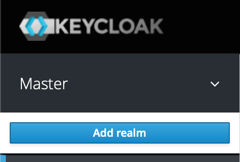

# User Federation Identity Provider (LDAP)
To configure Keycloak to work with OpenLDAP we need to login and setup our `ldap` container as a `User Federation` provider.

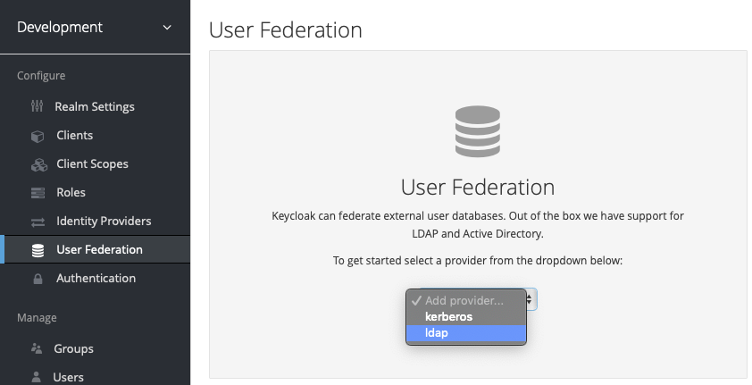

## Settings
Key settings you'll need to modify are as follows:

* `Edit Mode`: WRITABLE
* `Sync Registrations`: On
* `Vendor`: Other
* `Connection URL`: ldap://ldap.auth
* `Users DN`: ou=People,dc=jamesveitch,dc=dev
* `Bind DN`: cn=admin,dc=jamesveitch,dc=dev
* `Bind Credential`: <insert admin password>
* `Search Scope`: Subtree

(Optionally)

* `Periodic Full Sync`: On (and keep defaults for the `Period`)
* `Periodic Changed Users Sync`: On (and set `Period` to `5`)
<!-- * `Cache Policy`: Set to `NO_CACHE` for now -->

<!-- #TODO: Implement StartTLS with trusted certs -->

??? example "Identity Provider Configuration (Settings)"
    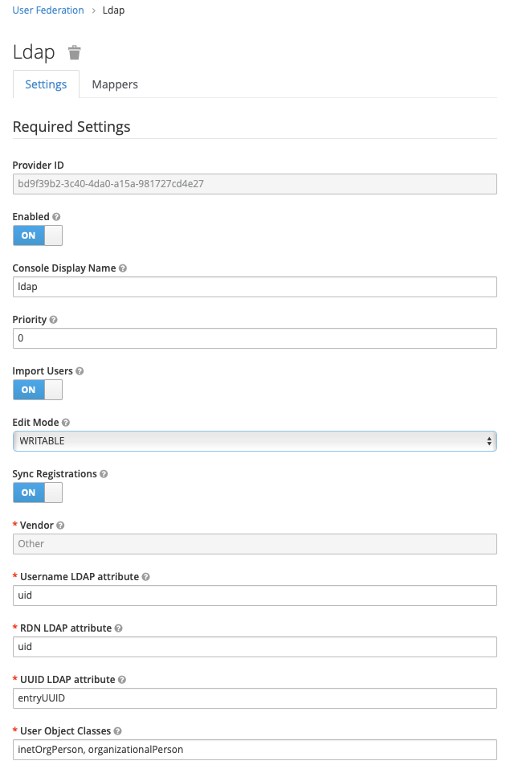
    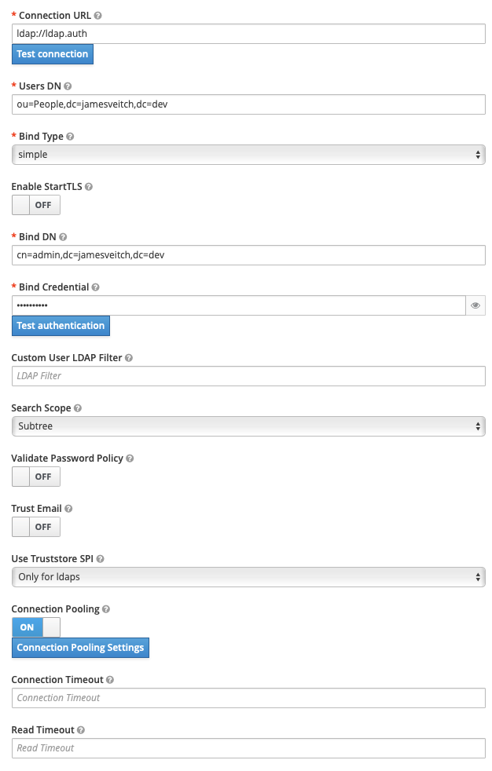
    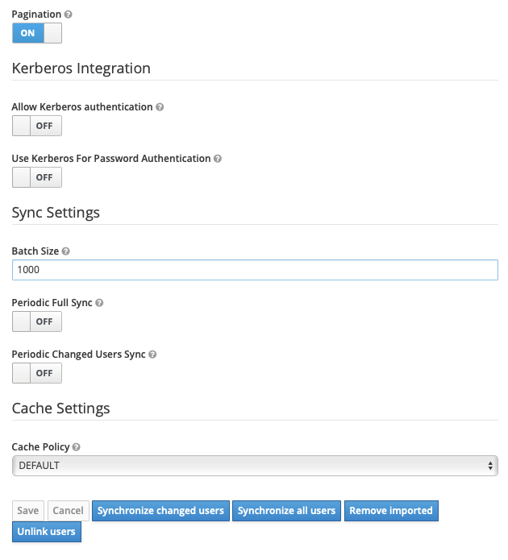

Hit `Save` --> `Synchronize all users` and you should see a success flash message appear at the top of the screen.

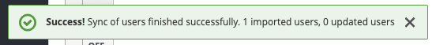

## Mappers
Mappers help to provide a translation layer between how data is stored in the provider and how we'd like to use it in Keycloak. For example, there are some standard ones created for you automatically based on your selection of the `Vendor` in the previous `Settings` tab.

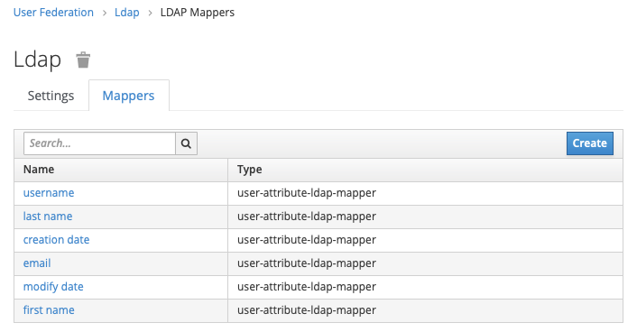

Clicking on the `username` will show you that:

* `Type`: It's a `user-attribute` mapper (used to map a single attribute from a LDAP user to the Keycloak user model)
* `Model Attribute`: This is what the attribute will be called in Keycloak
* `LDAP Attribute`: What the attribute is called in LDAP

??? example "Username attribute-ldap-mapper"
    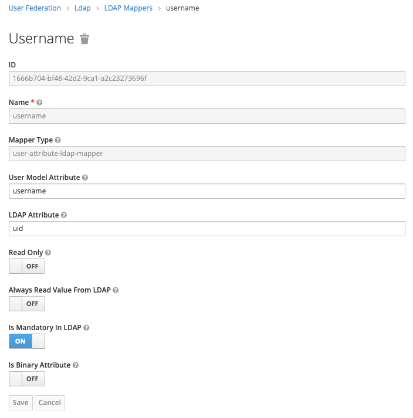

We are going to add some of our own custom mappers so that we can do things like identify what security groups a user is part of and, therefore, what resources they should be able to access inside Kubernetes.

# Create Groups and Mappers
As we created a number of Groups [in our previous step](../01.openldap#admin) (or have seeded with an LDIF) we need to tell Keycloak how to find and interpret them.

Go back into our `User Federation` --> `Ldap` --> `Mappers` and create two new ones.

## Realm Roles
This is a special mapping which will allow us to automatically allocate people to the right roles within the Keycloak administration setup.

* `Name`: realm roles
* `Type`: role-ldap-mapper
* `LDAP Groups DN`: ou=RealmRoles,ou=Groups,dc=jamesveitch,dc=dev
* `Use Realm Roles Mapping`: ON

Click `Save` --> `Sync LDAP Roles To Keycloak`

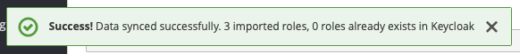

Navigating to **Roles** in the menu should show now our LDAP roles populated as `ldap-admin`, `ldap-user` and `realm-admin`

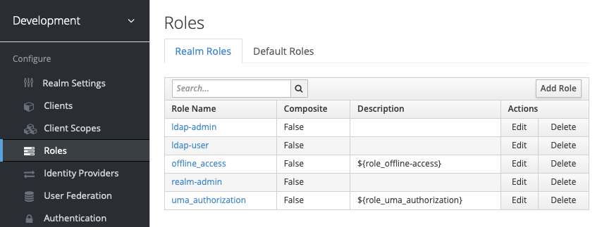

In addition, navigating to **Users** and then clicking into our user should show, on the **Role Mappings** tab, that we have these roles assigned to us.

We need to give this role some powers. In order to administer the `development` realm click on the `realm-admin` role and then turn `Composite Roles` to `ON`. From the `Client Roles` drop-down select `realm-management` then assign `realm-admin`.

??? example "Assign `realm-admin` powers"
    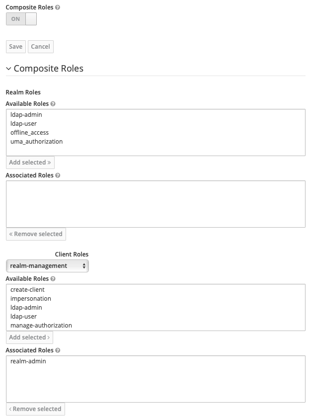

Navigate to [https://auth.jamesveitch.dev/auth/realms/development/account/](https://auth.jamesveitch.dev/auth/realms/development) and you should be able to login now as that user and manage your account.

Navigate to [https://auth.jamesveitch.dev/auth/admin/development/console](https://auth.jamesveitch.dev/auth/admin/development/console) and you should be able to administer the domain.


## Groups
This mapping will allow us to find any groups within the `Groups` OU and then map them automatically to users.

* `Name`: groups
* `Type`: group-ldap-mapper
* `LDAP Groups DN`: ou=Groups,dc=jamesveitch,dc=dev
* `Mapped Group Attributes`: description

Click on the `Sync LDAP Groups To Keycloak` button on each one down the bottom after saving the mapper and ensure you get a success overlay message that it's now imported the Groups we created earlier. Go to the `Settings` tab and then, down the bottom, click `Synchronize all users` to get a message about one user being updated (because it's now spotted some groups we're part of).

# Users
Go to `Users` and then click `View all users` to force it to perform an initial sync. You should see your user appear with an additional `admin` user (if using Master realm).

If you now select your user you should note on the `Groups` tab you have a `Group Membership` identified for all of the groups you're part of. In addition you have `admin` as an `Effective Role` in the `Role Mappings` tab (once you select `realm-management` from the `Client Roles` drop down) because it's mapped this through from your membership of the `realm-admin` group.

??? example "User: Group Membership"
    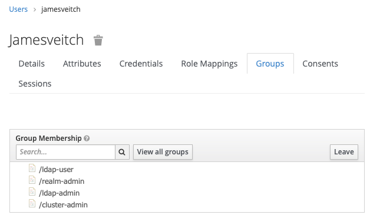

??? example "User: Role Mapping"
    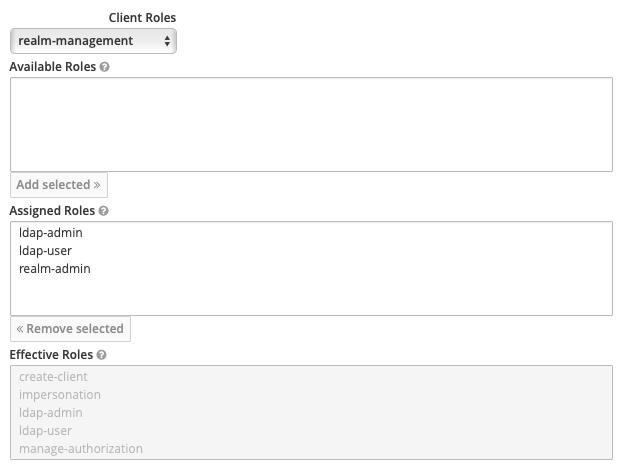

# Enabling MFA
Stealing with pride from documentation elsewhere we're going to enable TOTP based MFA for our initial user.

In the GUI you would navigate to `Authentication` --> `OTP Policy` and then update the following settings as required. The below are those we're using:

* `OTP Type`: Time Based
* `OTP Hash Algorith`: SHA512
* `Number of Digits`: 8
* `Look Ahead Window`: 3
* `OTP Token Period`: 30

Depending on appetite we can also navigate to the `Authentication` --> `Required Actions` tab and tick the `Default Action` box against `Configure OTP` if we want to enforce this for everyone by default.

## Impersonate user
Navigate to `Users` and then select `Impersonate` next to ours. This should change and give you a different screen where we can now setup MFA for our user. Select the `Authenticator` option and follow the instructions to get setup.

## Login
Logout using the `Sign Out` button in the top right of the screen and then attempt to sign back in with your new user. You'll be presented with the below requiring you to input a code from your app.

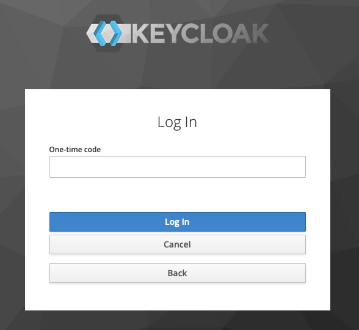

# Bootstrapping
We'll, later, bootstrap this into Keycloak via the [Importing a realm](https://github.com/jboss-dockerfiles/keycloak/tree/master/server#importing-a-realm) option. The easiest way to get your configuration back out of the system is to go the `Export` setting and then get the JSON output.

Unfortunately, due to the way in which the image is configured, the given method in the docs doesn't work (as volumes are mounted by `root` yet the application executes as the `jboss` user and therefore can't access the files). As a result we'll inherit from and build a custom image with a `/realms` folder that we can mount the JSON files into. #TODO: update with custom image.
