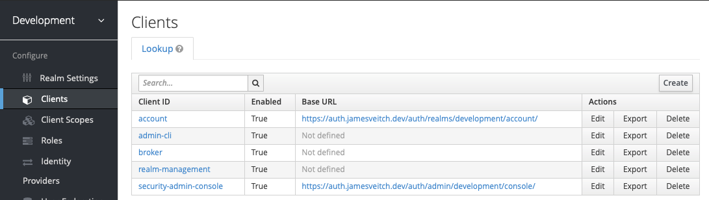
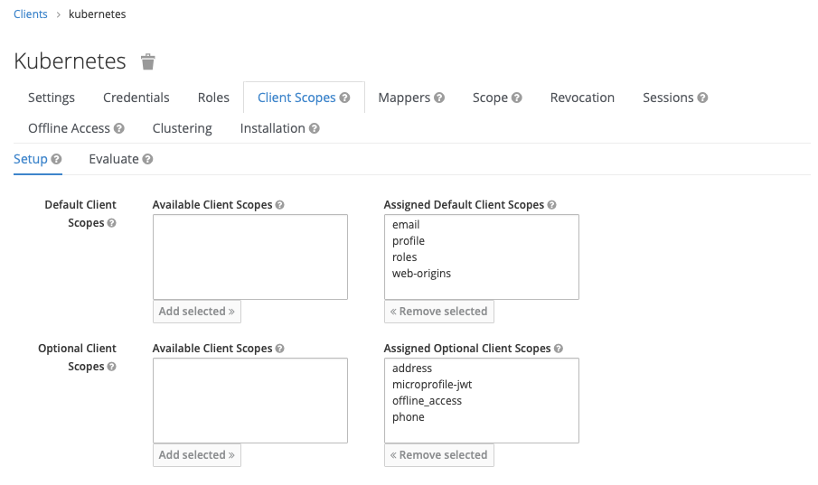
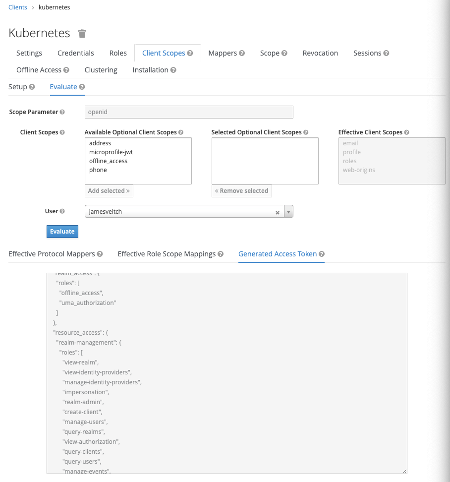
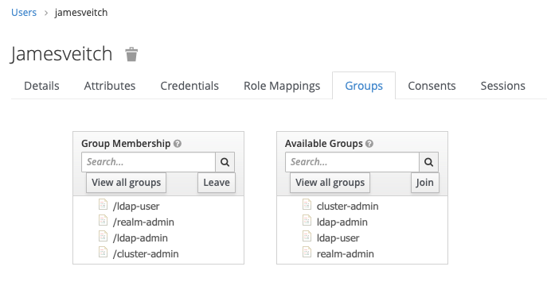
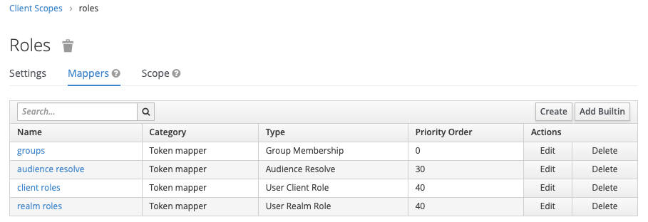
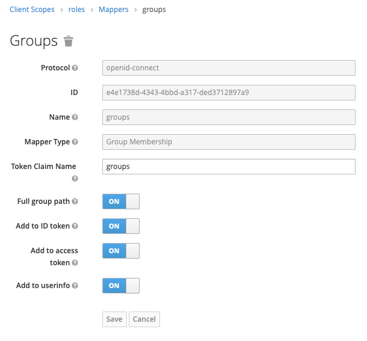

There's an excellent article on [Medium](https://medium.com/@mrbobbytables/kubernetes-day-2-operations-authn-authz-with-oidc-and-a-little-help-from-keycloak-de4ea1bdbbe) which partially covers what we're about to do and helped to solidify some of my thoughts. Highly worth a read for some background. In addition there's some official docs on [OpenID Connect Tokens](https://kubernetes.io/docs/reference/access-authn-authz/authentication/#openid-connect-tokens). At the bottom of this page I've included links to all of the [references](#references) I ended up needing to make this work.

We're going to now integrate our Kubernetes cluster's `Authentication` (identify someone) and `Authorisation` (what they should be able to do) with our Keycloak+OpenLDAP implementation.

Initially I'm going to prove that we should be able to login as `jamesveitch` (my `uid`).

??? tip "LDIF Export: James Veitch"
    Remember we exported the LDIF? If you review the file you'll see the following.
    ```ldif hl_lines="12"
    # Entry 11: cn=James Veitch,ou=People,dc=jamesveitch,dc=dev
    dn: cn=James Veitch,ou=People,dc=jamesveitch,dc=dev
    cn: James Veitch
    gidnumber: 500
    givenname: James
    homedirectory: /home/users/jamesveitch
    loginshell: /bin/bash
    objectclass: inetOrgPerson
    objectclass: posixAccount
    objectclass: top
    sn: Veitch
    uid: jamesveitch
    uidnumber: 1000
    userpassword: {CRYPT}$6$uby4/8dS$23r8h349f$ggnQE7Z7GUIW3IXe.1z4pUZ4HDQlukEwB6N4z6/p
    swn6r2Pg40wF6w5wopOP1f46f4MOI7BJ0
    ```

# Configure Keycloak
We need to setup a new `Client` inside Keycloak for Kubernetes to allow the Kubernetes API Server to authenticate users and read attributes (like whether or not they're members of the `cluster-admin` group).

Login to Keycloak and, in the `Development` realm, create a new client with `Clients` --> `Create`.

??? example "Create Client"
    

* `Client ID`: kubernetes
* `Protocol`: openid-connect
* `Root URL`: (leave this blank)

You're now presented with a fairly lengthy configuration screen. Use the following options as overrides to what should be provided as existing defaults.

* `Access Type`: confidential
* `Valid Redirect URIs`: 
    * http://localhost:8000
    * http://localhost:18000

Once saved we now have a new client.

???+ tip
    Navigating to the `Credentials` tab will show the necessary `secret` that needs to be given to Kubernetes.

## Telling applications about our users groups/roles
There's a few ways to achieve the outcome we're looking for --> obtain a list of `Groups` for a selected `User` from OpenLDAP and then inform an application in our token response of these when authenticating this user. The same way we performed some `mapping` from OpenLDAP into the Keycloak schema previously we'll now need to perform a similar task from Keycloak to our respective applications.

I'll cover both methods of passing data back in the token:

* Realm-wide change to a default `Client Scope`
* Individual client `Mapper`

??? "Realm-wide `Scope`"
    By default Keycloak creates a set of default `scopes` for all clients which sit in the `Client Scopes` menu. If you click on the tab with the same name in the kubernetes client we've created you'll see that theres some sub-tabs for `Setup` and `Evaluate`.

    ???+ example "Setup"
        By default our client has access to the `roles` scope.

        

    ??? example "Evaluate"
        If you select your user and click `Evaluate` it will show you the token you'll be returning to Kubernetes.

        

    We can hook into this mechanic if we want so that, by default, the `roles` scope returns a list of `Groups` our user is part of.

    ??? example "User Groups"
        You can check in Keycloak against your user - this will show what we've already mapped through from OpenLDAP.

        

    First off we can change the `roles` scope globally to include some additional information about `groups`. This gets assigned by default to all clients.

    Navigate to `Client Scopes` --> `roles` (edit) --> `Mappers` (tab) and add a new one.

    * Name: `groups`
    * Mapper Type: `Group Membership`
    * Token Claim Name: `groups`

    ??? example "Add Mapper to Default Scope"
        
        

    If you `evaluate` the client for your user you'll now see the following in the token.

    ```json
    ...
    "groups": [
      "/ldap-user",
      "/realm-admin",
      "/ldap-admin",
      "/cluster-admin"
    ],
    ...
    ```

??? "Client `Mapper`"

    You can associate groups for an individual client by adding the following mapper:

    * `Name`: groups
    * `Mapper Type`: Group Membership
    * `Client ID`: kubernetes
    * `Token Claim Name`: groups
    * `Add to ID token`: on

# Configure Kubectl with `kubelogin`
[Kubelogin](https://github.com/int128/kubelogin) is a `kubectl` plugin for Kubernetes OpenID Connect authentication designed to allow you to obtain a token from keycloak (or any OIDC provider) and then pass this to kubectl to use to authenticate as your user.


## Install latest version
```bash
export KUBELOGIN_VERSION=v1.15.2
curl -LO https://github.com/int128/kubelogin/releases/download/${KUBELOGIN_VERSION}/kubelogin_linux_amd64.zip
7z x kubelogin_linux_amd64.zip
chmod +x kubelogin
sudo mv kubelogin /usr/local/bin/kubectl-oidc_login
rm kubelogin_linux_amd64.zip LICENSE
```

## 1. Set up the OIDC provider
We should now be able to run an initial setup command, using the credentials we created in Keycloak for the client.

???+ warning "Local Port Forwarding"
    If you're working on a remote headless server (like me) then, in order for the below to work, you'll need to forward the port `8000` from your remote host to localhost so that the oidc webpage that grabs your token can load.

    ```bash
    ssh -L 8000:localhost:8000 adminlocal@banks.local
    ```

```bash tab="1. Set up the OIDC provider"
kubectl oidc-login setup \
    --oidc-issuer-url=https://auth.jamesveitch.dev/auth/realms/development \
    --oidc-client-id=kubernetes \
    --oidc-client-secret=YOUR_CLIENT_SECRET
```

On successfully validating access via localhost:8000 the following will be displayed. Have a quick look but don't worry, we'll step through each step individually.

??? info "Command Output"

    ```bash tab="2. Verify authentication"
    ## 2. Verify authentication
    Open http://localhost:8000 for authentication

    You got the following claims in the token:
        acr=1
        nbf=0
        iss=https://auth.jamesveitch.dev/auth/realms/development
        nonce=grKgiUYt6w5R6shPmv_kIoKa5eDf6n310VDG5aaFg1s
        session_state=4de7b14d-df9c-4edd-b165-54731bb74d76
        name=James Veitch
        preferred_username=jamesveitch
        groups=[/ldap-user /realm-admin /ldap-admin /cluster-admin]
        family_name=Veitch
        exp=1577571593
        email_verified=false
        aud=kubernetes
        sub=f0db1df3-5a2f-4095-b556-72912f8315cf
        azp=kubernetes
        given_name=James
        iat=1577571293
        typ=ID
        auth_time=1577571293
        jti=0dfc35b1-99e3-4f4b-8e4d-89424b1b3e51
    ```

    ```bash tab="3. Bind a role"
    ## 3. Bind a role

    Run the following command:

      kubectl apply -f - <<-EOF
      kind: ClusterRoleBinding
      apiVersion: rbac.authorization.k8s.io/v1
      metadata:
        name: oidc-cluster-admin
      roleRef:
        apiGroup: rbac.authorization.k8s.io
        kind: ClusterRole
        name: cluster-admin
      subjects:
      - kind: User
        name: https://auth.jamesveitch.dev/auth/realms/development#
      EOF
    ```

    ```bash tab="4. Set up the Kubernetes API server"
    ## 4. Set up the Kubernetes API server

    Add the following options to the kube-apiserver:

      --oidc-issuer-url=https://auth.jamesveitch.dev/auth/realms/development
      --oidc-client-id=kubernetes
    ```

    ```yaml tab="5. Set up the kubeconfig"
    ## 5. Set up the kubeconfig

    Add the following user to the kubeconfig:

      users:
      - name: google
        user:
          exec:
            apiVersion: client.authentication.k8s.io/v1beta1
            command: kubectl
            args:
            - oidc-login
            - get-token
            - --oidc-issuer-url=https://auth.jamesveitch.dev/auth/realms/development
            - --oidc-client-id=kubernetes
            - --oidc-client-secret=5ffe6efd-bc31-4009-bec4-0ef2f0b15505
    ```

## 2. Verify authentication
If we look at the commands output in this section you can see that it shows the details of the token received from Keycloak. A couple of important bits to note.

* **preferred_username**: This is what we will be using to log into kubernetes resources (and matches our username for keycloak)
* **groups**: An array of groups our user is a member of. Importantly we've got `/cluster-admin` in here... we'll have to access this with `oidc:/cluster-admin` in our RBAC manifests later with the prefix we'll set in the kube-apiserver.

## 3. Bind a role
If you were the impatient type and tried to immediately connect with kubectl you would find that, despite finding your user, you still cen't actually fdo anything. This is because, by default, the RBAC in kubernetes is set to deny all.

```bash
adminlocal@banks:~$ kubectl get pods

Open http://localhost:8000 for authentication
Error from server (Forbidden): pods is forbidden: User "https://auth.jamesveitch.dev/auth/realms/development#jamesveitch" cannot list resource "pods" in API group "" in the namespace "default"
```

We need to setup a mapping now between our `/cluster-admin` group from OpenLDAP and our default `cluster-admin` role in Kubernetes. We could also assign this directly to our `User` but that feels dirty and inflexible. Left here for reference but commented out.

```yaml
# file: ~/auth/cluster-admin.yaml
apiVersion: rbac.authorization.k8s.io/v1
kind: ClusterRoleBinding
metadata:
  name: oidc-cluster-admins
roleRef:
  apiGroup: rbac.authorization.k8s.io
  kind: ClusterRole
  name: cluster-admin
subjects:
# - apiGroup: rbac.authorization.k8s.io
#   kind: User
#   name: oidc/jamesveitch
- apiGroup: rbac.authorization.k8s.io
  kind: Group
  name: oidc/cluster-admin
```

Apply with `kubectl apply -f ~/auth/cluster-admin.yaml`.

## 4. Set up the Kubernetes API server
We'll now [configure the Kubernetes API Server](https://kubernetes.io/docs/reference/access-authn-authz/authentication/#configuring-the-api-server) to authenticate against an OIDC provider. In our case that's Keycloak.

This is running as it's own pod currently and we initialised it originally with our `kubeadm` command when [configuring kubernetes](../../01.infrastructure/02.kubernetes/00.configuring.kubernetes.md).

```bash hl_lines="9"
$ kubectl -n kube-system get pods

NAME                                       READY   STATUS    RESTARTS   AGE
calico-kube-controllers-74c9747c46-qlcqc   1/1     Running   2          9d
calico-node-f5t9f                          1/1     Running   2          9d
coredns-6955765f44-49w5d                   1/1     Running   2          9d
coredns-6955765f44-gvqlw                   1/1     Running   2          9d
etcd-banks.local                           1/1     Running   2          9d
kube-apiserver-banks.local                 1/1     Running   2          9d
kube-controller-manager-banks.local        1/1     Running   2          9d
kube-proxy-lxsr6                           1/1     Running   2          9d
kube-scheduler-banks.local                 1/1     Running   2          9d
```

If you look inside this pod with `describe` you'll see some commands have been passed to the container. We essentially need to edit and add to these so that it knows about our OIDC settings. The configuration file is stored by kubeadm in `/etc/kubernetes/manifests/kube-apiserver.yaml`.

```yaml hl_lines="17 18 19 20 21 22"
# file: /etc/kubernetes/manifests/kube-apiserver.yaml
spec:
  containers:
  - command:
    - kube-apiserver
    - --advertise-address=192.168.0.104
    - --allow-privileged=true
    - --authorization-mode=Node,RBAC
    - --client-ca-file=/etc/kubernetes/pki/ca.crt
    - --enable-admission-plugins=NodeRestriction
    - --enable-bootstrap-token-auth=true
    - --etcd-cafile=/etc/kubernetes/pki/etcd/ca.crt
    - --etcd-certfile=/etc/kubernetes/pki/apiserver-etcd-client.crt
    - --etcd-keyfile=/etc/kubernetes/pki/apiserver-etcd-client.key
    - --etcd-servers=https://127.0.0.1:2379
    ...
    - --oidc-issuer-url=https://auth.jamesveitch.dev/auth/realms/development
    - --oidc-client-id=kubernetes
    - --oidc-username-claim=preferred_username
    - --oidc-username-prefix=oidc/
    - --oidc-groups-claim=groups
    - --oidc-groups-prefix=oidc
```

**NB:** You'll notice that the `oidc/` and `oidc` are different for the groups and users above... This is deliberate as the groups come through automatically with the `/` prefixed to them. In addition I was unable to get the apiserver to load with the default `:` appended - must be an error with unsanitised string inputs to the commandline.

Once modified this should actually be detected and automatically reloaded/applied.

??? tip "Debugging the API Server"
    If something goes wrong above your apiserver will simply fail to load and you'll lose access to the cluster. To debug, run the following command and check the logs.

    ```bash
    sudo docker logs $(sudo docker ps -a | grep k8s_kube-apiserver| awk '{print $1}')
    ```

    Or, even better, undo what you've just done...

## 5. Set up the kubeconfig
Whilst the output from the initial setup command was a little cryptic, it's trying to tell us to create a new user associated with our cluster and then specify how credentials need to be obtained.

Edit your `~/.kube/config` and ensure we do the following:

* **contexts:** add a `user` to our `context` for the correct `cluster` (in our case `kubernetes`) called `keycloak`
* **users:** create a user called `keycloak` with the correct oidc settings.

??? example "`~/.kube/config`"

    ```yaml hl_lines="9 10 11 12 13 17 18 19 20 21 22 23 24 25 26 27"
    # file: ~/.kube/config
    apiVersion: v1
    clusters:
    - cluster:
        certificate-authority-data: LS0tLS1CRUdJTiBDRVJUSUZJQ0FURS0tLS0tCk1JSUN5RENDQWJDZ0F3SUJBZ0lCQURBTkJna3Foa2lHOXcwQkFRc0ZBREFWTVJNd0VRWU$
        server: https://192.168.0.104:6443
      name: kubernetes
    contexts:
    - context:
        cluster: kubernetes
        user: keycloak
      name: keycloak-oidc
    current-context: keycloak-oidc
    kind: Config
    preferences: {}
    users:
    - name: keycloak
      user:
        exec:
          apiVersion: client.authentication.k8s.io/v1beta1
          command: kubectl
          args:
          - oidc-login
          - get-token
          - --oidc-issuer-url=https://auth.jamesveitch.dev/auth/realms/development
          - --oidc-client-id=kubernetes
          - --oidc-client-secret=5ffe6efd-bc31-4009-bec4-0ef2f0b15505
    ```

# External `~/.kube/config`
At the moment we've been working exclusively within one of the nodes via ssh. Ideally though we can now copy this config somewhere locally to our actual development machine and leave any hardcoded credentials (like the admin keys) on the server instead.

Follow the [setup](https://github.com/int128/kubelogin#setup) guide to install `kubelogin` on the client machine and then configure your `~/.kube/config` as follows, changing out the necessary sections as appropriate (e.g. the server ip address).

```yaml
# file: ~/.kube/config
apiVersion: v1
clusters:
- cluster:
    certificate-authority-data: LS0tLS1CRUdJTiBDRVJUSUZJQ0FURS0tLS0tCk1JSUN5RENDQWJDZ0F3SUJBZ0lCQURBTkJna3Foa2lHOXcwQkFRc0ZBREFWTVJNd0VRWU$
    server: https://192.168.0.104:6443
  name: kubernetes
contexts:
- context:
    cluster: kubernetes
    user: keycloak
  name: keycloak-oidc
current-context: keycloak-oidc
kind: Config
preferences: {}
users:
- name: keycloak
  user:
    exec:
      apiVersion: client.authentication.k8s.io/v1beta1
      command: kubectl
      args:
      - oidc-login
      - get-token
      - --oidc-issuer-url=https://auth.jamesveitch.dev/auth/realms/development
      - --oidc-client-id=kubernetes
      - --oidc-client-secret=5ffe6efd-bc31-4009-bec4-0ef2f0b15505
```

This file can now be provided to anyone\* in a secure\*\* fashion. 

* \*  They'll need to be able to route to the cluster's IP address (more on that later); and

* \*\*  have a valid login in LDAP for it to be of any use though.

# References
As detailed in [Issue #19](https://github.com/darth-veitcher/homelab/issues/19) the following were helpful resources in my travels to get this working.

* [Kubernetes Day 2 Operations: AuthN/AuthZ with OIDC and a Little Help From Keycloak](https://medium.com/@mrbobbytables/kubernetes-day-2-operations-authn-authz-with-oidc-and-a-little-help-from-keycloak-de4ea1bdbbe)
* [Openldap Keycloak and docker](https://blog.exceptionerror.io/2018/08/29/openldap-keycloak-and-docker/)
* [Deep Dive: Kubernetes Single Sign-On (SSO) with OpenID Connection via G Suite](https://medium.com/@hbceylan/deep-dive-kubernetes-single-sign-on-sso-with-openid-connection-via-g-suite-a4f01bd4a48f)
* [Single Sign-On for Kubernetes: Dashboard Experience](https://www.tigera.io/blog/single-sign-on-for-kubernetes-dashboard-experience/)
* [Configuring Kubernetes login with Keycloak](https://blog.codecentric.de/en/2019/05/configuring-kubernetes-login-keycloak/)
* [kubectl with OpenID Connect](https://medium.com/@int128/kubectl-with-openid-connect-43120b451672)
* [Protect Kubernetes Dashboard with OpenID Connect](https://itnext.io/protect-kubernetes-dashboard-with-openid-connect-104b9e75e39c)
* [Kubernetes Identity Management Part II – RBAC and User Provisioning](https://www.tremolosecurity.com/kubernetes-identity-management-part-ii-rbac-and-user-provisioning/)
